<p align="center">
  
</p>

<h1 align="center">Lumora</h1>

<p align="center">
  <strong>Your local command center for native AI-agent CLIs.</strong>
</p>

<p align="center">
  Manage workspaces, find saved sessions, and run your coding agents in one
  focused desktop app—without taking ownership away from the provider.
</p>

<p align="center">
  <a href="https://github.com/HAYASAKA7/Lumora/releases"><strong>Download Lumora</strong></a>
  ·
  <a href="#quick-start">Quick start</a>
  ·
  <a href="#supported-providers">Supported providers</a>
  ·
  <a href="#technical-documentation">Documentation</a>
</p>

> [!WARNING]
> Lumora 0.3 is an unsigned preview release. Review the
> [unsigned build notices](#unsigned-build-notices) before installing it.

<p align="center">
  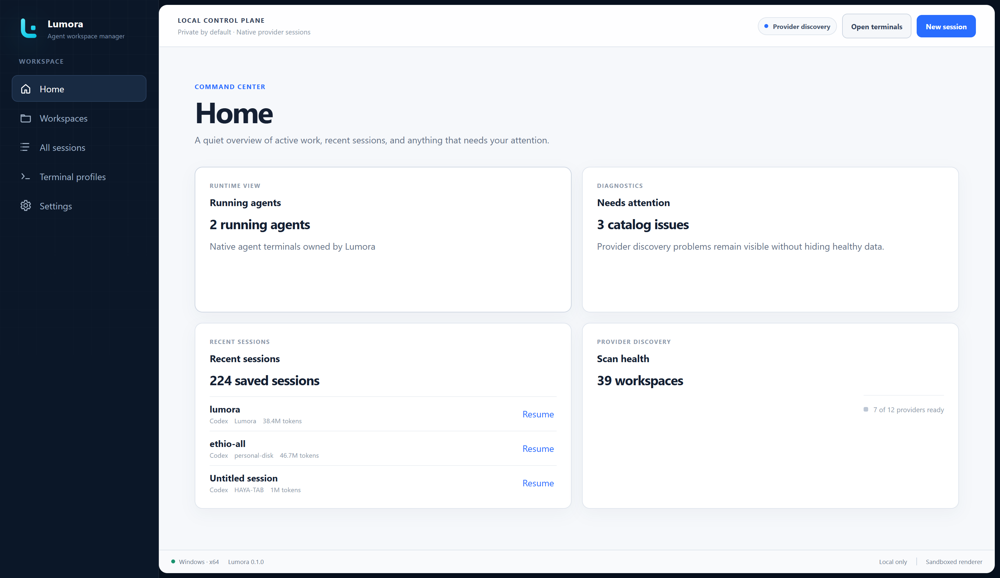
</p>

Lumora gives installed AI-agent command-line tools a shared desktop home for
workspace navigation, saved sessions, launch settings, and managed terminals.
Each provider keeps control of its own session files, authentication,
permissions, and usage limits.

## Why Lumora

| One place to work | Native sessions stay native | Local-first by design |
| --- | --- | --- |
| Move between projects, saved sessions, and live terminals without rebuilding your context. | Start, resume, and—where supported—fork the provider's real session instead of wrapping it in a proprietary format. | Lumora catalogs local metadata. Provider transcripts remain provider-owned read-only inputs unless you explicitly start a temporary cross-agent handoff. |
| **Flexible launches** | **Provider-aware workflows** | **Workspace trust** |
| Layer commands and environment settings globally or per provider, workspace, session, and launch. | Detect installed CLIs, check versions, install allowlisted npm providers, and show only supported actions. | Approve each canonical workspace path before an agent runs there, then revoke that decision whenever you want. |

## From provider to productive

| 1. Check your providers | 2. Find your work | 3. Run the native CLI |
| --- | --- | --- |
| 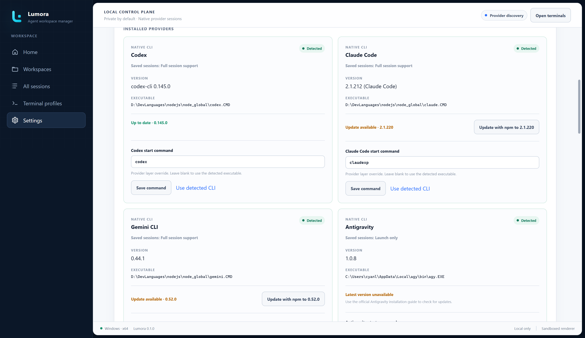 | 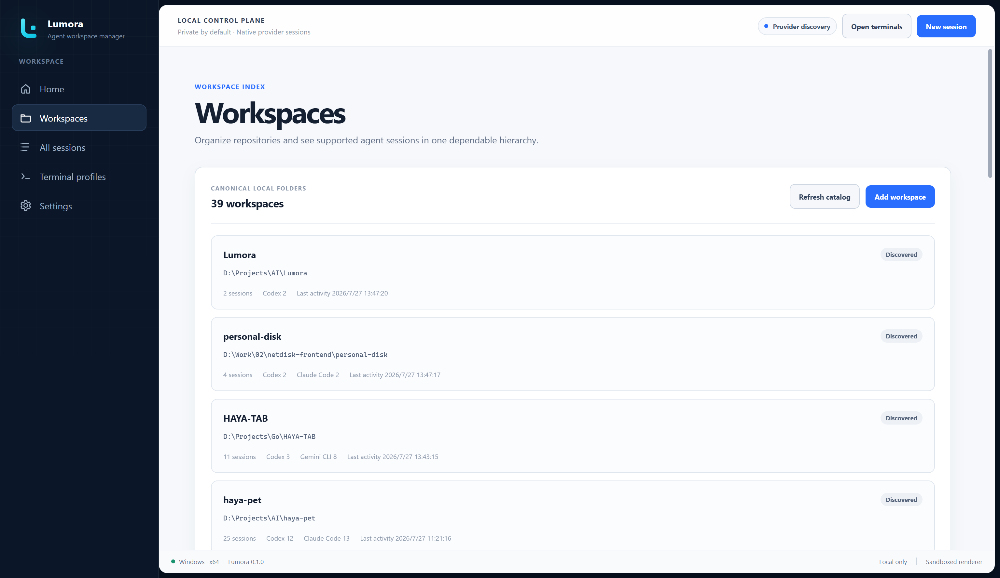 | 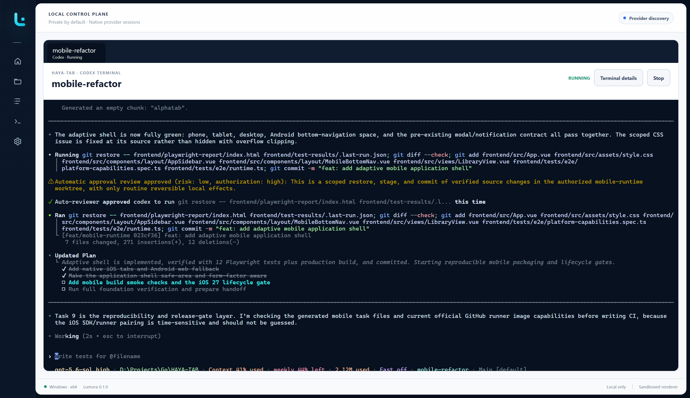 |
| Detect installed agents, review their versions, or install a supported npm package. | Browse provider-owned sessions by workspace, provider, title, or recent activity. | Start or resume the real provider process in a terminal that stays active while you navigate. |

## Get Lumora

Download the package for your system from
[GitHub Releases](https://github.com/HAYASAKA7/Lumora/releases).

| System | Package |
| --- | --- |
| Windows x64 | `Lumora-*-win-x64.exe` |
| macOS Apple Silicon | `Lumora-*-mac-arm64.dmg` |
| macOS Intel | `Lumora-*-mac-x64.dmg` |
| Linux x64 | `Lumora-*-linux-x86_64.AppImage` |

The assisted Windows installer lets you choose whether Lumora creates Start
Menu and desktop shortcuts. The Start Menu shortcut is selected by default;
the desktop shortcut is optional and is cleared by default. macOS DMG and
Linux AppImage packages do not show these Windows-specific choices.

### Unsigned build notices

The current packages are not code-signed or notarized.

- **Windows:** SmartScreen may warn about or block the installer. Confirm that
  the file came from this repository before allowing it.
- **macOS:** Gatekeeper may block the DMG or application. After verifying the
  source, use **System Settings > Privacy & Security > Open Anyway**.
- **Linux:** Make the AppImage executable before opening it:

  ```bash
  chmod +x Lumora-*.AppImage
  ```

Signing, notarization, and automatic updates are planned after preview testing.

## Before your first session

Lumora manages provider CLIs; it does not replace them. Your computer needs:

- Windows, macOS, or Linux.
- Node.js 22 or newer and npm. Lumora checks them separately at startup and
  links to the official Node.js download when they are missing.
- At least one [supported AI-agent CLI](#supported-providers).
- The account, authentication, and provider setup required by that CLI.

Provider commands must be available on `PATH`. You can confirm common commands
in a terminal:

```powershell
codex --version
claude --version
gemini --version
```

Every provider is optional. A missing or incompatible provider does not prevent
healthy providers from working.

## Quick start

1. Open **Settings > Environment** and confirm Node.js and npm are available.
2. Open **Settings > Providers** and review detected agents and versions.
3. Install a supported npm-based provider or follow its official installation
   guide, then select **Refresh**.
4. Open **Workspaces**, select **Add workspace**, and choose a project folder.
5. Select **New session**, then choose a workspace, provider, and terminal
   profile.
6. Review the effective launch command and confirm workspace trust.
7. Start the session. Lumora opens the provider in a managed terminal.

Provider authentication and approval prompts remain inside the terminal and
continue to be controlled by the provider.

## Workspaces and saved sessions

The **Workspaces** page groups provider-owned sessions by project directory.
Open a workspace to see its sessions, or use **All sessions** to search across
projects by title, workspace, and provider.

<p align="center">
  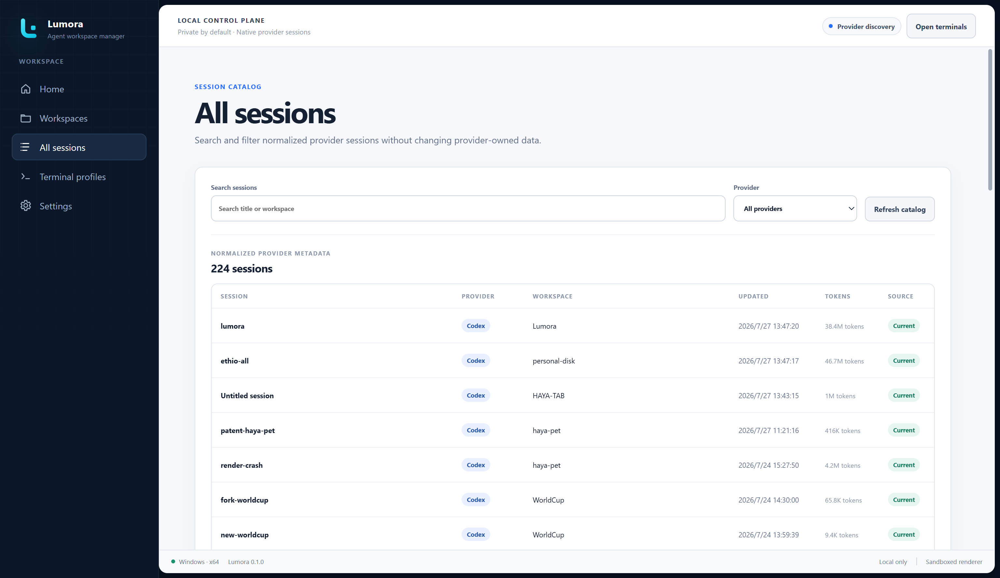
</p>

Select a saved session to continue it. Lumora can:

- resume the exact native session;
- fork Codex, Claude Code, or OpenCode into a separate provider-owned session
  while leaving the original unchanged; or
- when cross-agent handoff is enabled, start a new provider session from a
  temporary local copy of supported source context.

An initial task is optional when forking. Leave it empty to enter instructions
in the terminal, or provide one to launch the fork with that task.

The **Home** page keeps a smaller recent-session list with direct Resume
actions. Provider filters only include installed providers for which Lumora
found resumable sessions.

To remove an old project from everyday navigation without deleting anything,
open its workspace actions and choose **Hide workspace**. You can hide only the
workspace card while keeping its sessions in Home and All sessions, or hide the
workspace together with those sessions. Use **Hidden workspaces** on the
Workspaces page to search, select, and restore hidden entries. General settings
can also omit unavailable workspaces and currently unusable sessions. These
choices are isolated between local Lumora and each remote computer.

<details>
  <summary><strong>More workspace and navigation views</strong></summary>
  <br>
  <table>
    <tr>
      <td width="50%" align="center">
        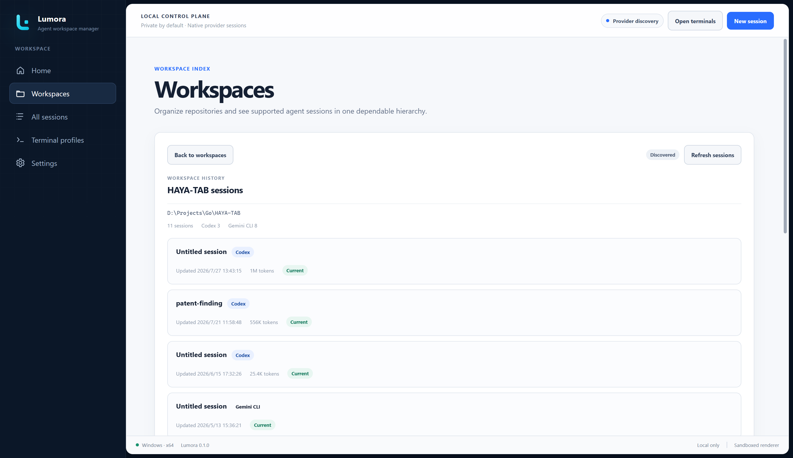
        <br><sub><strong>Workspace detail</strong> — sessions grouped inside one project.</sub>
      </td>
      <td width="50%" align="center">
        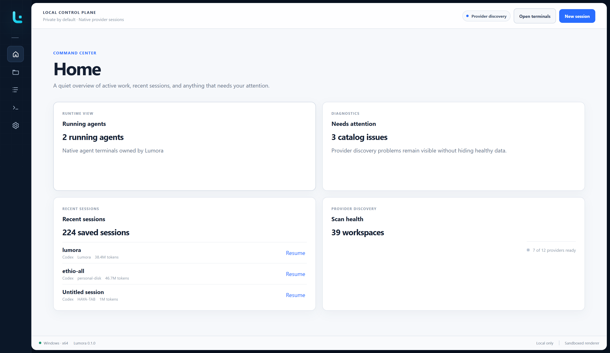
        <br><sub><strong>Focused navigation</strong> — collapse the sidebar when you want more room.</sub>
      </td>
    </tr>
  </table>
</details>

Lumora reads supported provider metadata but does not rewrite provider session
files or copy transcript bodies into its catalog. Cross-agent handoff creates a
separate temporary local copy only for the selected handoff; the original
session remains unchanged.

## Move sessions between devices

Lumora includes a guarded export-and-import workflow for provider-native session
files. Open **Settings > Transfer** to select eligible stopped sessions and
collect them into an encrypted-by-default `.lumora-sessions` archive. On the
destination device, the same Transfer page lets you select installed providers,
map source workspaces to existing local directories, and review duplicates and
other exclusions before import.

Transfer support is version- and route-specific. Verified combinations are
marked **Supported**; implemented combinations awaiting packaged verification
are available as **Experimental**. Unimplemented routes remain disabled. The
original archive and source sessions remain unchanged, so a provider skipped on
the first import can be retried later.

## Remote computers (experimental)

Lumora can create an isolated window for a trusted SSH computer and activate a
lightweight Lumora helper there. Add the computer from the separate **Remote**
entrance, verify its SHA-256 host fingerprint, then connect with a password,
private-key passphrase, or SSH agent. Credentials are ephemeral by default.
You can opt in per profile to remember a password or private-key passphrase in
operating-system secure storage, and separately opt in to automatic connection.

When the helper is missing or incompatible, the remote window shows the exact
per-user install location and version before asking for confirmation. Lumora
uploads a packaged helper for the detected remote operating system and
architecture, verifies its digest, activates it atomically, and completes a
bounded protocol handshake. Installation does not require administrator or
root access.

The isolated window also checks remote Node.js, npm, and the providers enabled
for that target. Home, Workspaces, and All sessions discover provider-owned
metadata for Codex, Claude Code, Gemini CLI, OpenCode, GitHub Copilot CLI, and
Qwen Code, and Kimi Code. From the same remote window, you can start a new session or resume
an exact session in an SSH-backed terminal. Provider start commands can be
customized per remote computer from the shared **Settings > Providers** cards
or layered under **Settings > Launch** without changing local launch settings.
The Providers page can also check versions and, after explicit confirmation,
install or update allowlisted npm-based CLIs on the connected computer without
administrator elevation. The remote shell follows global Lumora appearance while
keeping target data, terminals, trust, and provider choices isolated. See
[Remote computers](docs/REMOTE.md) for setup and test guidance.

See [Move sessions between devices](docs/SESSION_TRANSFER.md) for the archive
contents, password warning, mixed-provider behavior, workspace mapping, and
current verification matrix.
## Managed terminals

Active terminals stay mounted while you move between Lumora pages. Use the tab
bar or `Ctrl+Tab` to switch between active sessions. When the provider process
exits, Lumora closes its tab and refreshes the catalog.

Drag terminal tabs to arrange their visible left-to-right order. `Ctrl+Tab`
continues to use most-recently-used order. When a tab itself has focus,
`Alt+Shift+Left` and `Alt+Shift+Right` move it one position.

Terminal clipboard behavior:

- **Windows and Linux:** `Ctrl+V` pastes. `Ctrl+Shift+C` and `Ctrl+Shift+V`
  always copy and paste. `Ctrl+C` copies when text is selected. Right-click
  pastes clipboard text directly into a live terminal.
- **macOS:** `Command+C` copies and `Command+V` pastes. Right-click also pastes
  clipboard text into a live terminal.
- With no selection, the first `Ctrl+C` arms an interrupt and the second press
  stops the managed runtime. This reduces accidental process interruption.
- Codex receives `/exit` and `/quit` normally. If its process remains attached
  after the command, Lumora closes the runtime after a short grace period.

While terminal input is focused, providers receive their native shortcuts,
except for Lumora's configured terminal-switcher and sidebar-toggle shortcuts
(`Ctrl+Tab` and `Ctrl+Shift+L` by default). In Codex, `Shift+Enter` uses
a bracketed-paste compatibility sequence. This does not reliably insert a
newline in current Codex releases when hosted by Lumora, so Codex multiline
`Shift+Enter` remains an unresolved known issue. Other modified Enter
combinations keep their best-effort CSI-u compatibility encoding.

<details>
  <summary><strong>Terminal details and profiles</strong></summary>
  <br>
  <table>
    <tr>
      <td width="50%" align="center">
        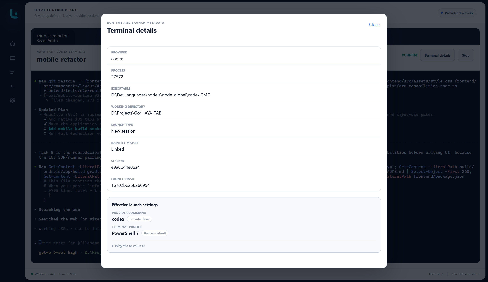
        <br><sub><strong>Terminal details</strong> — keep launch and session context close to the running agent.</sub>
      </td>
      <td width="50%" align="center">
        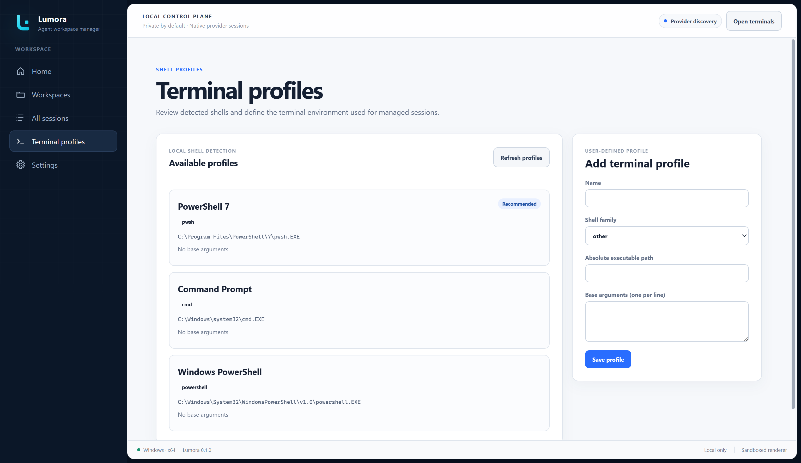
        <br><sub><strong>Terminal profiles</strong> — choose the shell used to launch providers.</sub>
      </td>
    </tr>
  </table>
</details>

## Settings and launch control

Lumora resolves launch settings in increasing precedence:

```text
Global < Provider < Workspace < Session < One-time launch
```

The launch preview shows the effective command, working directory, terminal,
and the layer that supplied each value. Custom commands, aliases, and wrappers
work when the selected terminal profile can resolve them.

<p align="center">
  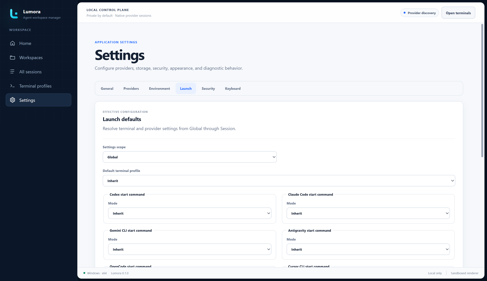
</p>

### General

Choose startup and navigation behavior, informational notices, and enabled
providers. Cross-agent session handoff is off by default. When enabled, its
retention setting controls when Lumora removes temporary managed copies.

Lumora also has a native tray or menu-bar icon. You can choose whether closing
the window exits Lumora and its managed agents, or hides the window while they
continue running. The tray menu can restore Lumora, show the number of running
agents, open a recent session's normal resume confirmation, or exit Lumora.

### Providers and environment

Review installation status and versions, install or update supported npm-based
agents after confirmation, open official setup guides, and check Node.js and
npm independently from provider discovery.

### Appearance

Open **Settings > Appearance** to choose Lumora mixed, Light, or Dark. Lumora
mixed—the original dark-sidebar and light-workspace design—is the default.
Theme changes apply immediately. Terminals stay dark by default even in Light
mode; enable the separate light-terminal switch
if you prefer a fully light workspace.

You can also choose a PNG, JPEG, or WebP image as a shared background across
the sidebar, workspace, cards, terminals, and in-app dialogs. Lumora keeps the
original file unchanged and creates a bounded private copy. Image opacity,
brightness, blur, fit, position, surface opacity, terminal opacity, and the
optional Surface mosaic can be adjusted without restarting the app. Surface
and terminal opacity both support the full `0–100%` range. Component surfaces
use related opacity levels so controls, cards, and page chrome remain distinct;
dialogs stay more opaque for readability. Surface mosaic defaults to `0 px`,
which leaves the image unblurred; raise it through `24 px` for a frosted-glass
effect. Removing the managed copy does not remove the original.

### Security

The first launch in an exact canonical workspace path requires confirmation.
Lumora stores the decision locally and applies it to new and resumed sessions.
You can revoke it from Settings; a changed path requires a new decision.

Workspace trust is a consent gate, not an operating-system sandbox. The agent
still runs with your user account's permissions.

### Diagnostics

Open **Settings > Diagnostics** to review Lumora's current process count,
working-set memory, CPU use, recent lifecycle events, and whether the previous
run ended unexpectedly. The bounded local journal stores structured health
signals only—it excludes prompts, terminal output, session content,
credentials, environment values, and filesystem paths. The same page lets you
choose the automatic journal folder; that change is applied safely on the next
launch. Lumora also remembers the last successful export folder, while every
**Export diagnostics** action still lets you choose another filename or
location. Lumora never uploads diagnostic data.

### Keyboard

All application shortcuts below can be changed in **Settings > Keyboard**.

| Default shortcut | Action |
| --- | --- |
| `Ctrl+Tab` | Cycle active terminal tabs in most-recently-used order |
| `Alt+Shift+Left` / `Alt+Shift+Right` | Move the focused terminal tab |
| `Ctrl+Shift+T` | Return to running terminals and focus terminal input |
| `Ctrl+Shift+L` | Collapse or expand the sidebar |
| `Ctrl+1` | Open Home |
| `Ctrl+2` | Open Workspaces |
| `Ctrl+3` | Open All sessions |
| `Ctrl+4` | Open Terminal profiles |
| `Ctrl+5` | Open Remote computers |
| `Ctrl+,` | Open Settings |

<details>
  <summary><strong>Explore Settings</strong></summary>
  <br>
  <table>
    <tr>
      <td width="50%" align="center">
        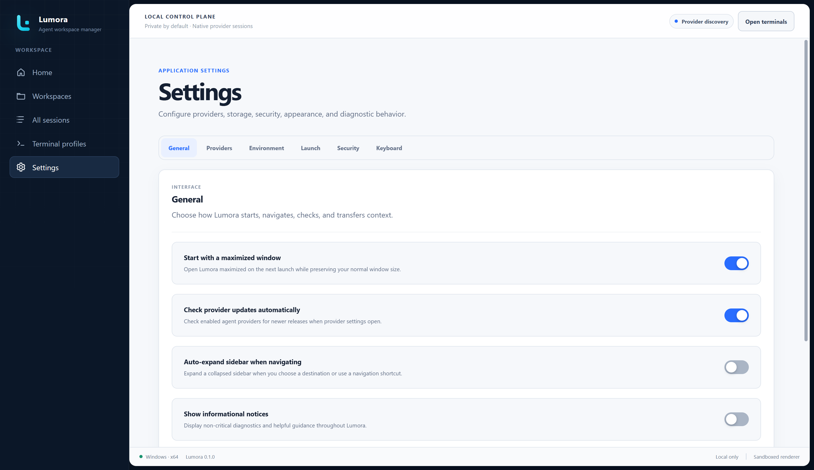
        <br><sub><strong>General</strong> — startup, navigation, notices, and handoff retention.</sub>
      </td>
      <td width="50%" align="center">
        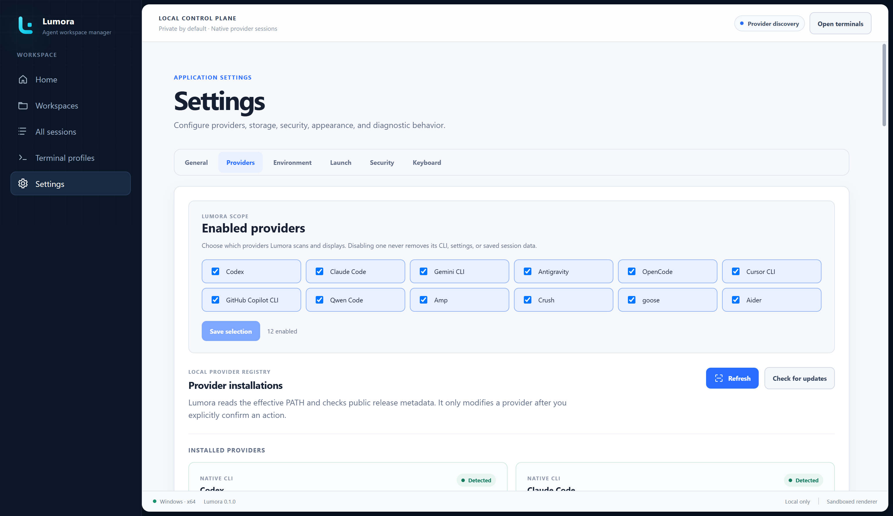
        <br><sub><strong>Provider selection</strong> — choose which agents appear throughout Lumora.</sub>
      </td>
    </tr>
    <tr>
      <td width="50%" align="center">
        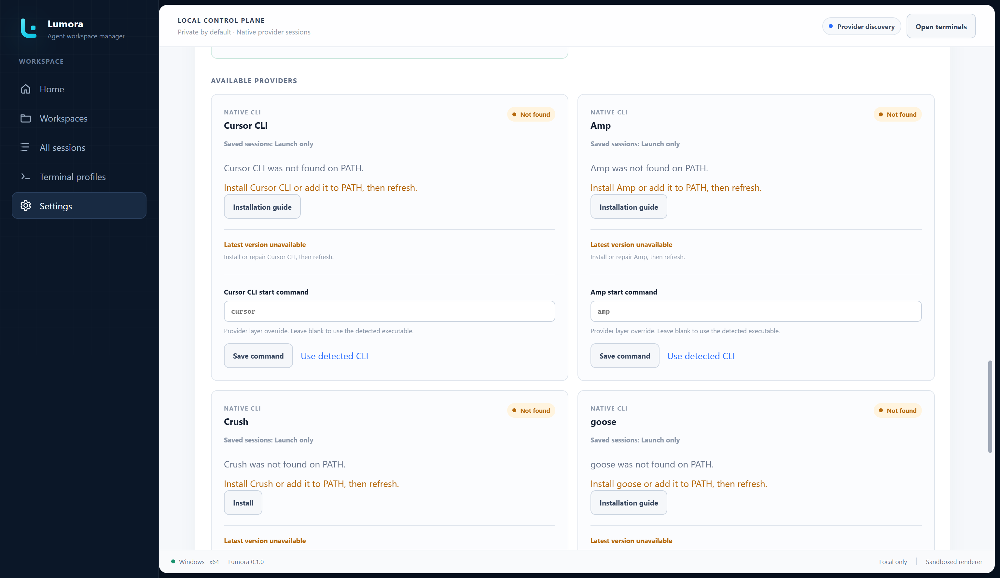
        <br><sub><strong>Provider installation</strong> — confirm allowlisted npm actions before they run.</sub>
      </td>
      <td width="50%" align="center">
        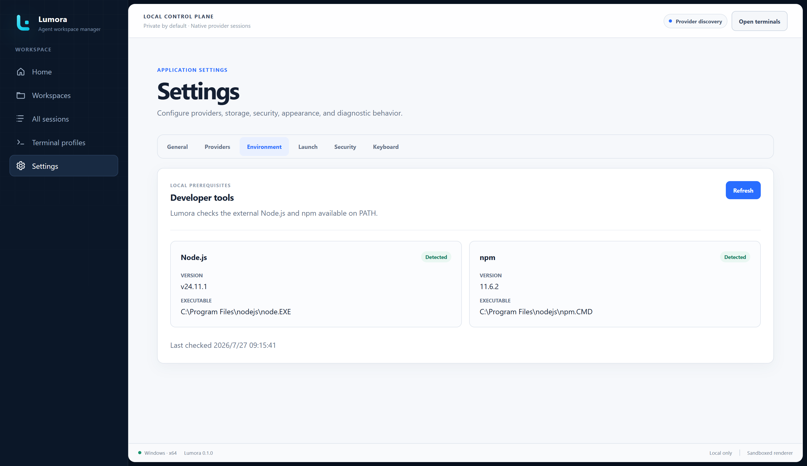
        <br><sub><strong>Environment</strong> — check Node.js and npm prerequisites independently.</sub>
      </td>
    </tr>
    <tr>
      <td width="50%" align="center">
        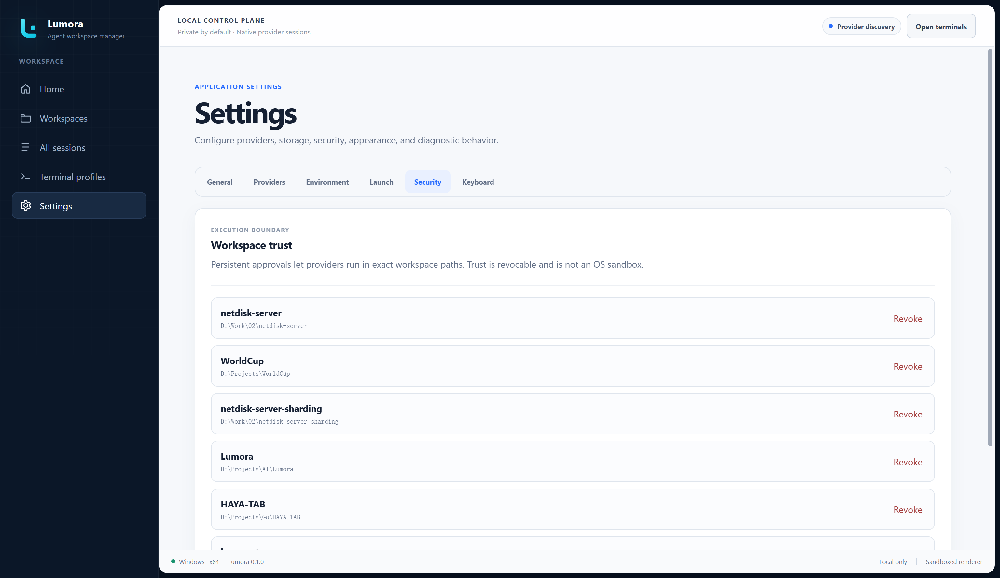
        <br><sub><strong>Security</strong> — review and revoke trusted workspace paths.</sub>
      </td>
      <td width="50%" align="center">
        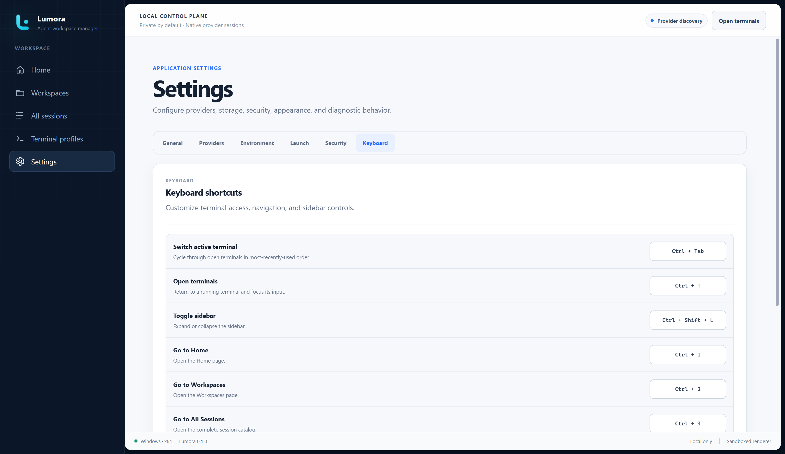
        <br><sub><strong>Keyboard</strong> — customize application shortcuts.</sub>
      </td>
    </tr>
  </table>
</details>

## Supported providers

| Provider | Install/update | New session | Saved-session discovery and exact resume | Native fork |
| --- | --- | --- | --- | --- |
| Codex | Confirmed npm action | Yes | Yes | Yes |
| Claude Code | Confirmed npm action | Yes | Yes | Yes |
| Gemini CLI | Confirmed npm action | Yes | Yes | No |
| OpenCode | Confirmed npm action | Yes | Yes | Yes |
| GitHub Copilot CLI | Confirmed npm action | Yes | Yes | No |
| Qwen Code | Confirmed npm action | Yes | Yes | No |
| Kimi Code | Confirmed npm install; official updater | Yes | Yes | No |
| Antigravity | Official guide | Yes | No | No |
| Cursor CLI | Official guide | Yes | No | No |
| Amp | Official guide | Yes | No | No |
| Crush | Confirmed npm action | Yes | No | No |
| goose | Official guide | Yes | No | No |
| Aider | Official guide | Yes | No | No |

All providers can be launched on Windows, macOS, and Linux when their command
is installed and compatible. Launch-only providers remain available in
Settings and New session, but do not appear in saved-session pages or filters.

The seven providers with complete session support can be used as handoff
sources. Codex, Claude Code, Gemini CLI, OpenCode, GitHub Copilot CLI, and Qwen
Code can also be handoff destinations. Kimi remains source-only because its
documented prompt flag is non-interactive and cannot safely create an
interactive destination session. A handoff never converts or replaces the
source provider's session.

Cross-device transfer is available as an explicit Experimental workflow for
all seven full-session providers, including Kimi Code. Kimi archives preserve
the selected native session directory and identity, exclude credentials and
global provider configuration, and require destination-workspace mapping on
import.

See [Provider support and verification](docs/PROVIDER_SUPPORT.md) for detection
commands, tested native-fork versions, and the manual release matrix.

## Data, privacy, and trust

Lumora is local-first and has no Lumora cloud synchronization. It stores
normalized session metadata, settings, trust decisions, window state, and
managed runtime history in the operating system's application-data location.
Provider session files remain provider-owned read-only inputs.

A native same-provider fork delegates context handling to the provider and does
not create a Lumora transcript copy.

Cross-agent handoff is the explicit, opt-in exception. Lumora stores an
immutable source copy, normalized conversation files, and a small manifest
under its local application-data directory. These files are used only to
bootstrap the destination provider, are not added to the searchable catalog,
and are removed according to the retention period in General settings.

Lumora does not add privacy guarantees beyond those of the provider CLI. The
provider may contact its own services according to its terms and configuration.

## Current limitations

- Generic PTY processes cannot be reattached after Lumora restarts. Lumora
  reports affected runtimes and lets you resume or restart them.
- Antigravity, Cursor CLI, Amp, Crush, goose, and Aider are launch-only.
- Cross-agent handoff is opt-in and depends on provider session formats.
  Lumora preserves user and assistant messages, while compact tool-activity
  coverage can vary by provider version. A failure does not change the source
  session or prevent exact native resume.
- Provider-native authentication and approval flows must be completed inside
  the embedded terminal.
- WSL-specific orchestration, cloud sync, transcript full-text indexing, custom
  provider definitions, and complete enhanced-keyboard protocol negotiation
  are outside the current MVP. Lumora forwards provider shortcuts that xterm
  preserves. Modified Enter support is best-effort; Codex `Shift+Enter`
  multiline input remains unresolved in the embedded terminal even with
  Lumora's current compatibility sequence.
- Read-only session-content previews are deferred. The intended design is an
  on-demand Session Details view with a small normalized excerpt that neither
  resumes the provider nor imports its transcript into Lumora's catalog.
- Terminal viewport sizing remains a known issue on some layouts.
- Remote computers are experimental. New sessions and exact native resume are
  available for the seven session-managed providers on supported SSH targets;
  remote cross-agent handoff, native fork, and session transfer remain future
  phases.

## Technical documentation

- [Troubleshooting guide](docs/TROUBLESHOOTING.md)
- [Cross-device session transfer](docs/SESSION_TRANSFER.md)
- [Remote computers](docs/REMOTE.md)
- [Provider support and verification](docs/PROVIDER_SUPPORT.md)
- [Architecture and privacy model](docs/ARCHITECTURE.md)
- [Development guide](docs/DEVELOPMENT.md)
- [Packaging and release guide](docs/RELEASING.md)
- [Changelog](CHANGELOG.md)

## Development

Lumora is an Electron 43, React 19, and TypeScript 6 application. Development
requires Node.js 22 or newer.

```powershell
npm ci
npm run dev
```

Before submitting a code change:

```powershell
npm run verify
```

See the [development guide](docs/DEVELOPMENT.md) for architecture boundaries,
focused test commands, provider integration rules, and packaging details.

---

<p align="center">
  Lumora is local-first, provider-native, and authored by
  <a href="https://github.com/HAYASAKA7">HAYASAKA7</a>.
</p>
