<p align="center">
  
</p>

<h1 align="center">Lumora</h1>

<p align="center">
  <strong>Your local-first command center for native AI-agent CLIs.</strong>
</p>

<p align="center">
  Manage workspaces, find saved sessions, and run your coding agents locally or
  on trusted SSH computers—without taking ownership away from the provider.
</p>

<p align="center">
  <a href="https://github.com/HAYASAKA7/Lumora/releases"><strong>Download Lumora</strong></a>
  ·
  <a href="#quick-start">Quick start</a>
  ·
  <a href="#supported-providers">Supported providers</a>
  ·
  <a href="#technical-documentation">Documentation</a>
</p>

> [!WARNING]
> Lumora 0.5 is an unsigned preview release. Review the
> [unsigned build notices](#unsigned-build-notices) before installing it.

<p align="center">
  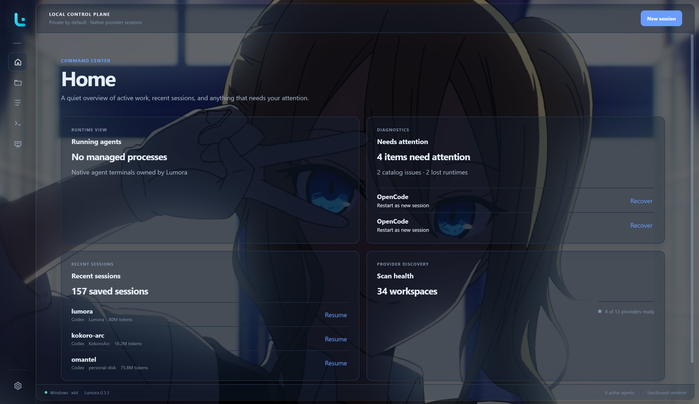
</p>

Lumora gives installed AI-agent command-line tools a shared desktop home for
workspace navigation, saved sessions, launch settings, managed terminals, and
experimental remote-computer access. Each provider keeps control of its own
session files, authentication, permissions, and usage limits.

## Why Lumora

| One place to work | Native sessions stay native | Local-first by design |
| --- | --- | --- |
| Move between projects, saved sessions, live terminals, and trusted remote computers without rebuilding your context. | Start, resume, and—where supported—fork the provider's real session instead of wrapping it in a proprietary format. | Lumora catalogs metadata locally. Provider transcripts remain provider-owned read-only inputs unless you explicitly start a temporary cross-agent handoff. |
| **Flexible launches** | **Provider-aware workflows** | **Workspace trust** |
| Layer commands and environment settings globally or per provider, workspace, session, and launch. | Detect installed CLIs, check versions, install allowlisted npm providers, and show only supported actions. | Approve each canonical workspace path before an agent runs there, then revoke that decision whenever you want. |

## From provider to productive

| 1. Check your providers | 2. Find your work | 3. Run the native CLI |
| --- | --- | --- |
| Detect installed agents, review their versions, or install a supported npm package. | Browse provider-owned sessions by workspace, provider, title, or recent activity. | Use a verified local Unified UI when available, with automatic native-terminal fallback. |

## Get Lumora

Download the package for your system from
[GitHub Releases](https://github.com/HAYASAKA7/Lumora/releases).

| System | Package |
| --- | --- |
| Windows x64 | `Lumora-*-win-x64.exe` |
| macOS Apple Silicon | `Lumora-*-mac-arm64.dmg` |
| macOS Intel | `Lumora-*-mac-x64.dmg` |
| Linux x64 | `Lumora-*-linux-x86_64.AppImage` |

The assisted Windows installer lets you choose whether Lumora creates Start
Menu and desktop shortcuts. The Start Menu shortcut is selected by default;
the desktop shortcut is optional and is cleared by default. macOS DMG and
Linux AppImage packages do not show these Windows-specific choices.

### Unsigned build notices

The current packages are not code-signed or notarized.

- **Windows:** SmartScreen may warn about or block the installer. Confirm that
  the file came from this repository before allowing it.
- **macOS:** Gatekeeper may block the DMG or application. After verifying the
  source, use **System Settings > Privacy & Security > Open Anyway**.
- **Linux:** Make the AppImage executable before opening it:

  ```bash
  chmod +x Lumora-*.AppImage
  ```

Signing, notarization, and automatic updates are planned after preview testing.

## Before your first session

Lumora manages provider CLIs; it does not replace them. Your computer needs:

- Windows, macOS, or Linux.
- Node.js 22 or newer and npm. Lumora checks them separately at startup and
  links to the official Node.js download when they are missing.
- At least one [supported AI-agent CLI](#supported-providers).
- The account, authentication, and provider setup required by that CLI.

Provider commands must be available on `PATH`. You can confirm common commands
in a terminal:

```powershell
codex --version
claude --version
gemini --version
```

Every provider is optional. A missing or incompatible provider does not prevent
healthy providers from working.

## Quick start

1. Open **Settings > Environment** and confirm Node.js and npm are available.
2. Open **Settings > Providers** and review detected agents and versions.
3. Install a supported npm-based provider or follow its official installation
   guide, then select **Refresh**.
4. Open **Workspaces**, select **Add workspace**, and choose a project folder.
5. Select **New session**, then choose a workspace, provider, and terminal
   profile.
6. Review the effective launch command and confirm workspace trust.
7. Start the session. Lumora opens a verified local Unified UI when available,
   or the provider's native TUI in a managed terminal.

Provider authentication and approval prompts remain inside the terminal and
continue to be controlled by the provider.

## Workspaces and saved sessions

The **Workspaces** page groups provider-owned sessions by project directory.
Open a workspace to see its sessions, or use **All sessions** to search across
projects by title, workspace, and provider.

<p align="center">
  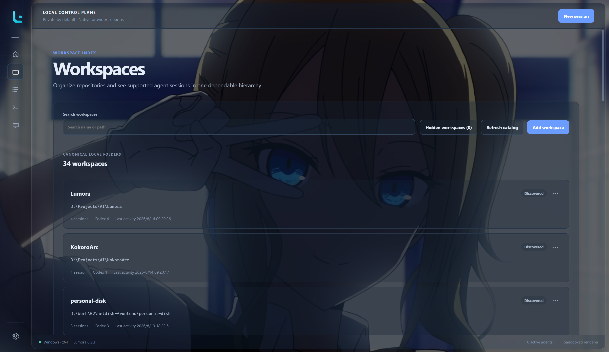
</p>

Select a saved session to continue it. Lumora can:

- resume the exact native session;
- fork Codex, Claude Code, or OpenCode into a separate provider-owned session
  while leaving the original unchanged; or
- when cross-agent handoff is enabled, start a new provider session from a
  temporary local copy of supported source context.

An initial task is optional when forking. Leave it empty to enter instructions
in the terminal, or provide one to launch the fork with that task.

The **Home** page keeps a smaller recent-session list with direct Resume
actions. Provider filters only include installed providers for which Lumora
found resumable sessions. Its Provider discovery card also reports verified
agent updates when automatic update checks are enabled; select the notice to
open the existing update workflow in **Settings > Providers**.

<p align="center">
  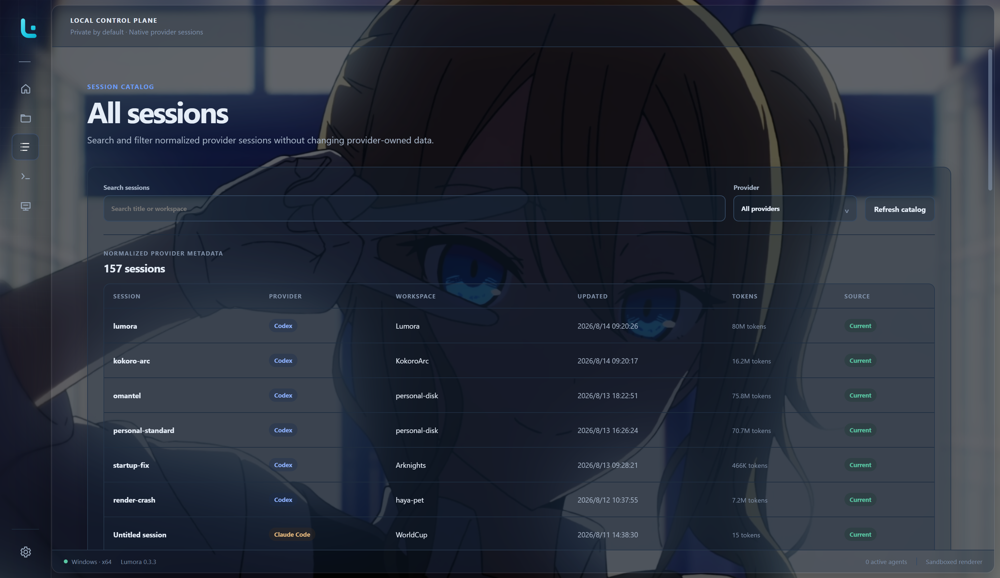
</p>

To remove an old project from everyday navigation without deleting anything,
open its workspace actions and choose **Hide workspace**. You can hide only the
workspace card while keeping its sessions in Home and All sessions, or hide the
workspace together with those sessions. Use **Hidden workspaces** on the
Workspaces page to search, select, and restore hidden entries. General settings
can also omit unavailable workspaces and currently unusable sessions. These
choices are isolated between local Lumora and each remote computer.

Lumora reads supported provider metadata but does not rewrite provider session
files or copy transcript bodies into its catalog. Cross-agent handoff creates a
separate temporary local copy only for the selected handoff; the original
session remains unchanged.

## Move sessions between devices

Lumora includes a guarded export-and-import workflow for provider-native session
files. Open **Settings > Transfer** to select eligible stopped sessions and
collect them into an encrypted-by-default `.lumora-sessions` archive. On the
destination device, the same Transfer page lets you select installed providers,
map source workspaces to existing local directories, and review duplicates and
other exclusions before import.

<p align="center">
  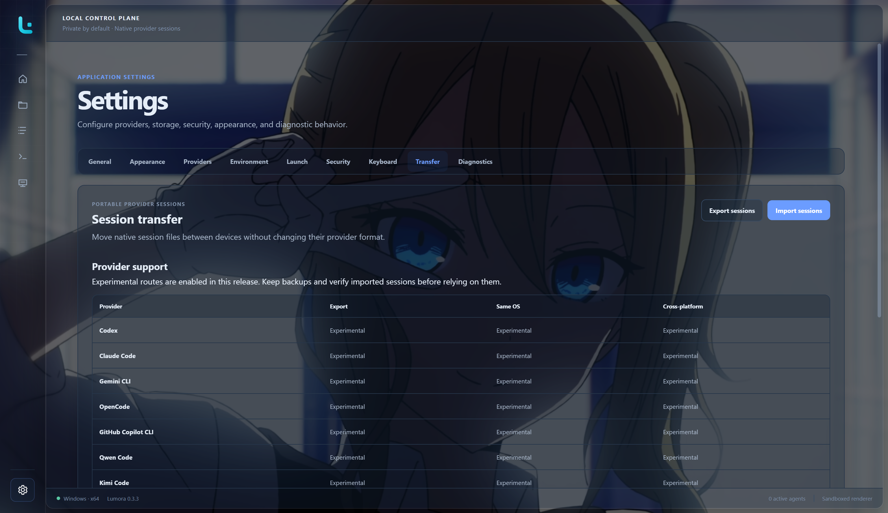
</p>

Transfer support is version- and route-specific. Verified combinations are
marked **Supported**; implemented combinations awaiting packaged verification
are available as **Experimental**. Unimplemented routes remain disabled. The
original archive and source sessions remain unchanged, so a provider skipped on
the first import can be retried later.

## Remote computers (experimental)

Lumora can create an isolated window for a trusted SSH computer and activate a
lightweight Lumora helper there. Add the computer from the separate **Remote**
entrance, verify its SHA-256 host fingerprint, then connect with a password,
private-key passphrase, or SSH agent. Credentials are ephemeral by default.
You can opt in per profile to remember a password or private-key passphrase in
operating-system secure storage, and separately opt in to automatic connection.

<p align="center">
  
</p>

Each target opens in its own Remote Lumora window. When automatic connection is
enabled, Lumora goes straight to a connecting state; if authentication fails,
the same window returns to the connection form with the error. Closing a remote
window can either preserve its SSH connection for fast reopening or disconnect
it, according to that target's setting. Before disconnect-and-close stops
active remote terminals, Lumora asks for confirmation. The Remote computers
page keeps each profile's current connection state visible from the main
Lumora window.

When the helper is missing or incompatible, the remote window shows the exact
per-user install location and version before asking for confirmation. Lumora
uploads a packaged helper for the detected remote operating system and
architecture, verifies its digest, activates it atomically, and completes a
bounded protocol handshake. Installation does not require administrator or
root access.

The isolated window also checks remote Node.js, npm, and the providers enabled
for that target. Home, Workspaces, and All sessions discover provider-owned
metadata for Codex, Claude Code, Gemini CLI, OpenCode, GitHub Copilot CLI,
Qwen Code, and Kimi Code. From the same remote window, you can start a new
session or resume an exact session in an SSH-backed terminal. Provider start
commands can be customized per remote computer from its **Settings > Providers**
cards or layered under **Settings > Launch** without changing local launch
settings.
The Providers page can also check versions and, after explicit confirmation,
install or update allowlisted npm-based CLIs on the connected computer without
administrator elevation. The remote shell follows global Lumora appearance while
keeping target data, terminals, trust, and provider choices isolated. See
[Remote computers](docs/REMOTE.md) for setup and test guidance.

<details>
  <summary><strong>Remote connection and helper setup</strong></summary>
  <br>
  <table>
    <tr>
      <td width="50%" align="center">
        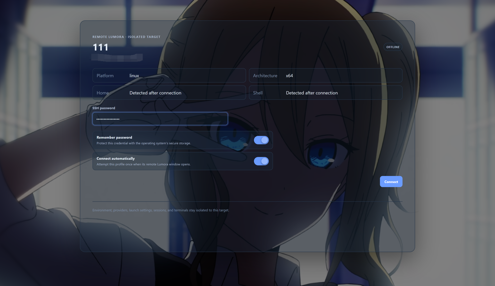
        <br><sub><strong>Connect</strong> — choose password, private key, or SSH agent authentication per profile.</sub>
      </td>
      <td width="50%" align="center">
        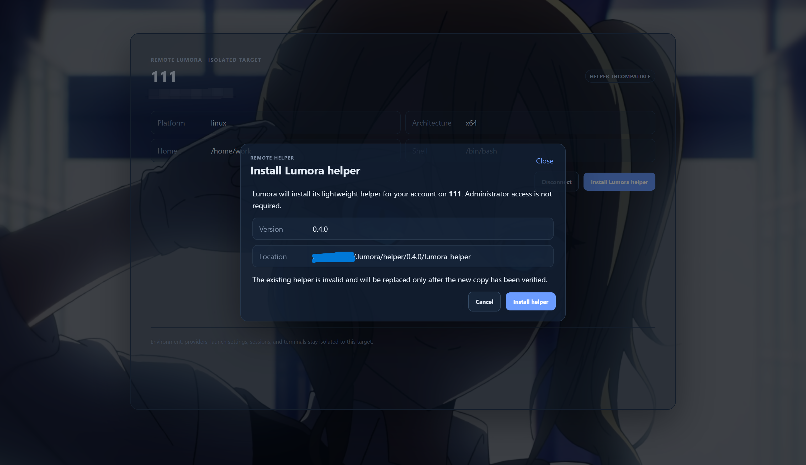
        <br><sub><strong>Install helper</strong> — review the bounded per-user helper installation before Lumora changes the remote account.</sub>
      </td>
    </tr>
  </table>
</details>

See [Move sessions between devices](docs/SESSION_TRANSFER.md) for the archive
contents, password warning, mixed-provider behavior, workspace mapping, and
current verification matrix.

## Unified agent interface

Lumora 0.5 adds a local chat-style interface for Codex, Claude Code, and Gemini
CLI. Each route uses the provider's structured integration—Codex app-server,
Claude Agent SDK, or Gemini ACP—and is enabled only after Lumora completes a
capability check. Open **Settings > Providers** to review each result or turn
the Unified UI off for an individual provider.

The Unified UI can show streamed Markdown responses, provider commands and
models, cancellation, approvals, process and tool activity, changed-file diffs,
session token usage, and account limits when the provider exposes them. Long
sessions initially render only a bounded recent window; scroll upward to load
earlier turns progressively.

Lumora 0.5 also makes session startup feel substantially faster. Selecting a
session begins the direct resume flow immediately, keeps its preparation and
loading inside the terminal workspace, and leaves the rest of Lumora responsive
while the provider connects. For long sessions, the bounded recent-history
window avoids waiting for the complete conversation to render before the
session becomes useful.

Select a saved session normally to resume it directly. Lumora returns to an
existing runtime when the session is already active, uses the verified Unified
UI when supported, and otherwise resumes through the native PTY without an
extra dialog. When a provider's Unified UI preference is enabled, right-click
a stopped session to explicitly open it in **Unified UI** or in the **native
terminal**. The native-terminal choice applies to that launch only and does not
change the saved provider preference. The same menu keeps the advanced resume
action for provider selection, handoff, fork, launch overrides, or other
detailed options. Workspace trust confirmation still appears unless you
explicitly enable and confirm **Settings > Security > Automatically trust
workspaces**.

Remote Lumora remains PTY-based in 0.5. Structured-interface settings and local
capability results do not claim remote support. A failed or incompatible local
structured integration also falls back to the provider's existing native TUI,
so the Unified UI does not remove the terminal workflow.

## Managed terminals

When the sidebar is expanded, Lumora separates **Running sessions** from
**Recent sessions** in collapsible lists. Select a running session to return to
its mounted terminal, or select a recent session to open the normal guarded
resume flow. The recent list loads progressively as it scrolls, and both lists
refresh when a managed runtime exits. Empty lists stay hidden.

Active terminals stay mounted while you move between Lumora pages. On the
terminal page, use the sidebar or `Ctrl+Tab` to switch between active sessions.
The terminal tab strip appears when the sidebar is collapsed and stays hidden
while it is expanded, without unmounting terminal views. The shortcut remains
inactive on other pages. When the provider process exits, Lumora closes its tab
and refreshes the catalog and sidebar lists.

Drag terminal tabs to arrange their visible left-to-right order. `Ctrl+Tab`
continues to use most-recently-used order. When a tab itself has focus,
`Alt+Shift+Left` and `Alt+Shift+Right` move it one position.
Long session names stay within a stable tab width and use an ellipsis when
clipped; hover the title to see its complete name in a Lumora tooltip.

Terminal clipboard behavior:

- **Windows and Linux:** `Ctrl+V` pastes. `Ctrl+Shift+C` and `Ctrl+Shift+V`
  always copy and paste. `Ctrl+C` copies when text is selected. Right-click
  pastes clipboard text directly into a live terminal.
- **macOS:** `Command+C` copies and `Command+V` pastes. Right-click also pastes
  clipboard text into a live terminal.
- With no selection, the first `Ctrl+C` arms an interrupt and the second press
  stops the managed runtime. This reduces accidental process interruption.
- Codex receives `/exit` and `/quit` normally. If its process remains attached
  after the command, Lumora closes the runtime after a short grace period.

While terminal input is focused, providers receive their native shortcuts,
except for Lumora's configured terminal-switcher and sidebar-toggle shortcuts
(`Ctrl+Tab` and `Ctrl+Shift+L` by default). In Codex, `Shift+Enter` uses
a bracketed-paste compatibility sequence. This does not reliably insert a
newline in current Codex releases when hosted by Lumora, so Codex multiline
`Shift+Enter` remains an unresolved known issue. Other modified Enter
combinations keep their best-effort CSI-u compatibility encoding.

<p align="center">
  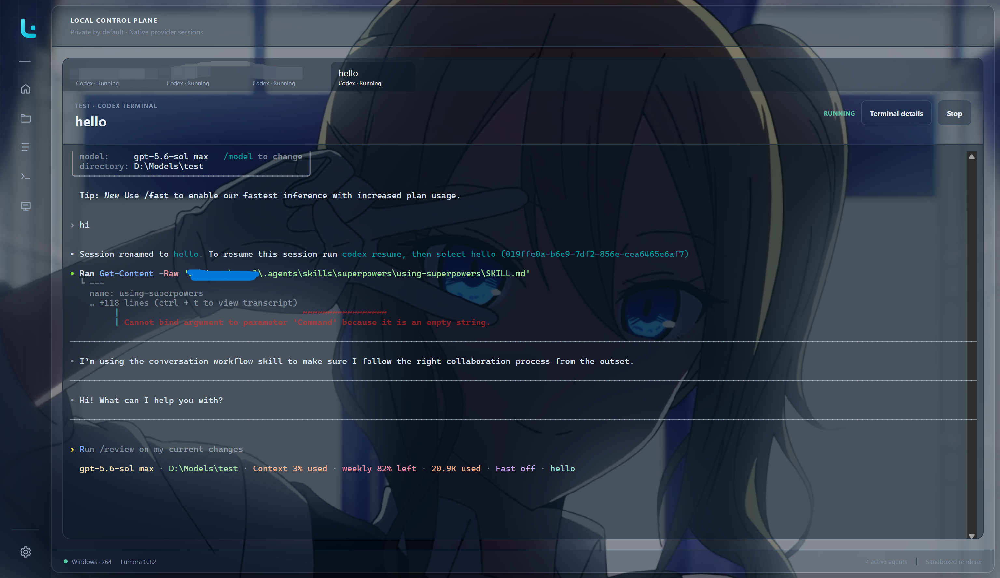
</p>

<details>
  <summary><strong>Terminal profiles</strong></summary>
  <br>
  <p align="center">
    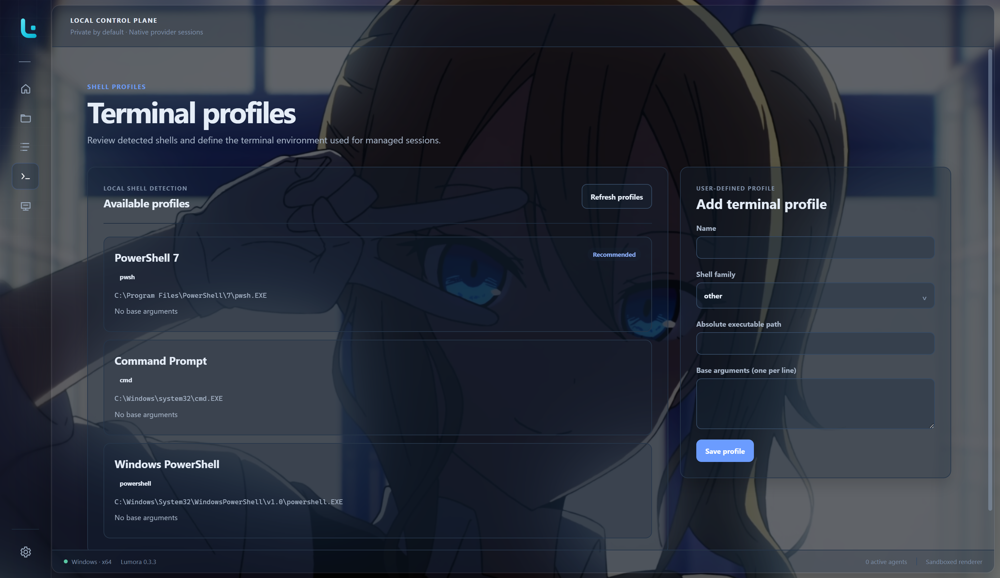
    <br><sub><strong>Terminal profiles</strong> — inspect detected shells and choose the profile used to launch providers.</sub>
  </p>
</details>

## Settings and launch control

Lumora resolves launch settings in increasing precedence:

```text
Global < Provider < Workspace < Session < One-time launch
```

The launch preview shows the effective command, working directory, terminal,
and the layer that supplied each value. Custom commands, aliases, and wrappers
work when the selected terminal profile can resolve them.

### General

Choose startup and navigation behavior, informational notices, and enabled
providers. Cross-agent session handoff is off by default. When enabled, its
retention setting controls when Lumora removes temporary managed copies.
General behavior and appearance are global: changes apply consistently to the
local window and every Remote Lumora window. Provider selection, launch values,
workspace visibility, trust, and terminal state remain isolated per target.

Lumora also has a native tray or menu-bar icon. You can choose whether closing
the window exits Lumora and its managed agents, or hides the window while they
continue running. The tray menu can restore Lumora, show the number of running
agents, open a recent session's normal resume confirmation, or exit Lumora.
Before a full exit stops active local or remote agents, Lumora asks for
confirmation. Full-exit and remote disconnect-and-close warnings have separate
switches in **Settings > General**, and each confirmation can disable its own
future warning.

### Language

Lumora includes English, Simplified Chinese, Traditional Chinese, Japanese,
and Korean. On first use, Lumora follows a supported operating-system language
and otherwise falls back to English. Choose an explicit language in
**Settings > General > Language**; the selection is global across local and
Remote Lumora windows, native menus, notifications, dialogs, and formatted
dates and counts. Agent TUI output, commands, prompts, paths, and user-owned
names are never translated.

Advanced users can manage the data-only Mods directory from
**Settings > Mods**, add a locale or partially override an existing one, then
reload packs without restarting Lumora. The Mods directory defaults to
Lumora's per-user data but can be changed to another writable local folder.
Changing it does not move or delete existing files. Invalid packs are isolated
and the last valid catalog stays active. The same Mods root contains `fonts`
and `themes` folders for optional data-only font and theme presets. See
[Localization and Mods](docs/localization.md) for the directory layout,
language manifest, preset formats, compatibility rules, limits, and recovery
steps.

### Providers and environment

Review installation status and versions, install or update supported npm-based
agents after confirmation, open official setup guides, and check Node.js and
npm independently from provider discovery. The enabled-provider list controls
which agents Lumora scans and presents across Home, Workspaces, All sessions,
launch flows, and remote targets. Installed provider cards expose detected
versions, update status, and optional custom start commands; missing providers
show their supported installation route or official guide.

### Appearance

Open **Settings > Appearance** to choose Lumora mixed, Light, or Dark. Lumora
mixed—the original dark-sidebar and light-workspace design—is the default.
Theme changes apply immediately. Terminals stay dark by default even in Light
mode; enable the separate light-terminal switch
if you prefer a fully light workspace.

The same page lets you choose independent interface and terminal fonts from
fonts already installed on the computer running Lumora. Clear either field to
restore Lumora's cross-platform default stack. Changes apply immediately,
including to terminals that are already open, without restarting the provider
or losing scrollback. Remote Lumora uses fonts installed on the local computer
that renders its window, not fonts installed on the SSH target. Data-only font
presets placed under the Mods `fonts` folder can apply either or both choices;
Lumora does not install or load font files in this version.

Validated data-only theme packs in the Mods `themes` folder can replace the
application's semantic color palette without editing individual components or
loading executable code. Choose and preview a pack under **Settings >
Appearance**. If a selected pack is removed or becomes invalid, Lumora safely
uses its matching built-in theme until the pack is restored.

You can also choose a PNG, JPEG, or WebP image as a shared background across
the sidebar, workspace, cards, terminals, and in-app dialogs. Lumora keeps the
original file unchanged and creates a bounded private copy. Image opacity,
brightness, blur, fit, position, surface opacity, terminal opacity, and the
optional Surface mosaic can be adjusted without restarting the app. Surface
and terminal opacity both support the full `0–100%` range. Component surfaces
use related opacity levels so controls, cards, and page chrome remain distinct;
dialogs stay more opaque for readability. Surface mosaic defaults to `0 px`,
which leaves the image unblurred; raise it through `24 px` for a frosted-glass
effect. Removing the managed copy does not remove the original.

### Security

The first launch in an exact canonical workspace path requires confirmation.
Lumora stores the decision locally and applies it to new and resumed sessions.
You can revoke it from Settings; a changed path requires a new decision.

Workspace trust is a consent gate, not an operating-system sandbox. The agent
still runs with your user account's permissions.

### Diagnostics

Open **Settings > Diagnostics** to review active local agents, Lumora's own
Electron process count, cumulative working-set memory, CPU use, recent lifecycle
events, and whether the previous run ended unexpectedly. The bounded local
journal stores structured health signals only—it excludes prompts, terminal
output, session content, credentials, environment values, and filesystem
paths. The same page lets you choose the automatic journal folder; that change
is applied safely on the next launch. Lumora also remembers the last successful
export folder, while every **Export diagnostics** action still lets you choose
another filename or location. Lumora never uploads diagnostic data.

### About and versions

Open **Settings > About** to review the installed Lumora version, developer,
and local platform. Remote Lumora also shows the connected helper version and
remote platform. Lumora checks public GitHub release metadata in the background
and shows **View update** only when a newer stable release is available. The
current unsigned editions do not download or install updates automatically.

### Keyboard

All application shortcuts below can be changed in **Settings > Keyboard**.
Lumora does not use browser-style `Tab` or `Shift+Tab` navigation. Editable
controls keep their focus, managed terminals receive their native Tab input,
and application navigation remains available through the shortcuts below.

| Default shortcut | Action |
| --- | --- |
| `Ctrl+Tab` | Cycle active terminal tabs in most-recently-used order while the terminal page is visible |
| `Alt+Shift+Left` / `Alt+Shift+Right` | Move the focused terminal tab |
| `Ctrl+Shift+T` | Return to running terminals and focus terminal input |
| `Ctrl+Shift+L` | Collapse or expand the sidebar |
| `Ctrl+1` | Open Home |
| `Ctrl+2` | Open Workspaces |
| `Ctrl+3` | Open All sessions |
| `Ctrl+4` | Open Terminal profiles |
| `Ctrl+5` | Open Remote computers |
| `Ctrl+,` | Open Settings |

<details>
  <summary><strong>Explore current Settings</strong></summary>
  <br>
  <table>
    <tr>
      <td width="50%" align="center">
        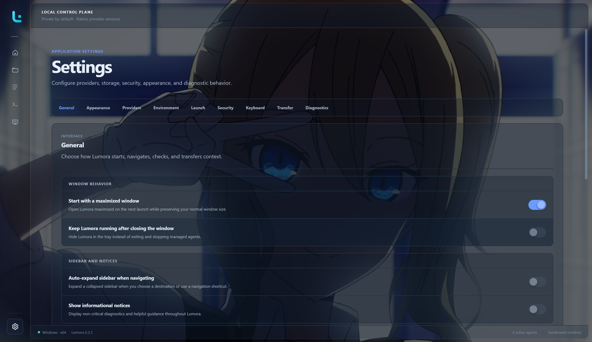
        <br><sub><strong>General</strong> — configure startup, close behavior, navigation, notices, and shared application behavior.</sub>
      </td>
      <td width="50%" align="center">
        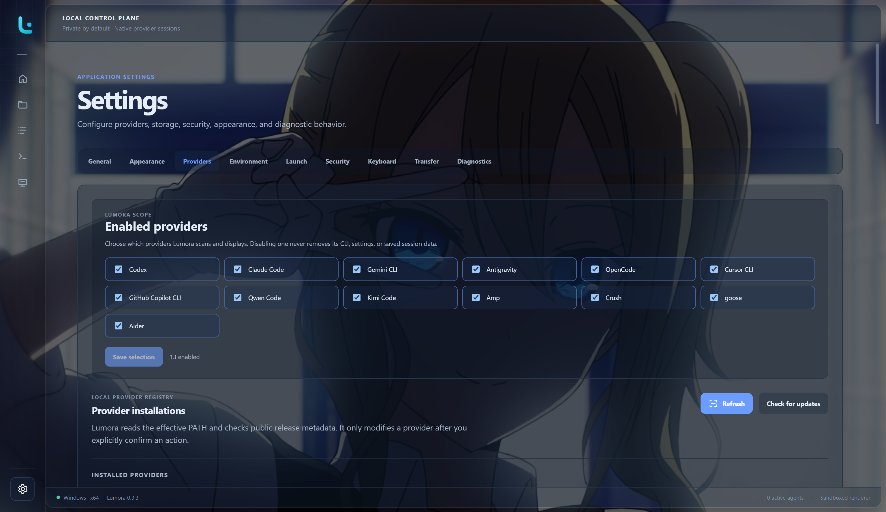
        <br><sub><strong>Provider selection</strong> — choose which agents Lumora discovers and displays.</sub>
      </td>
    </tr>
    <tr>
      <td width="50%" align="center">
        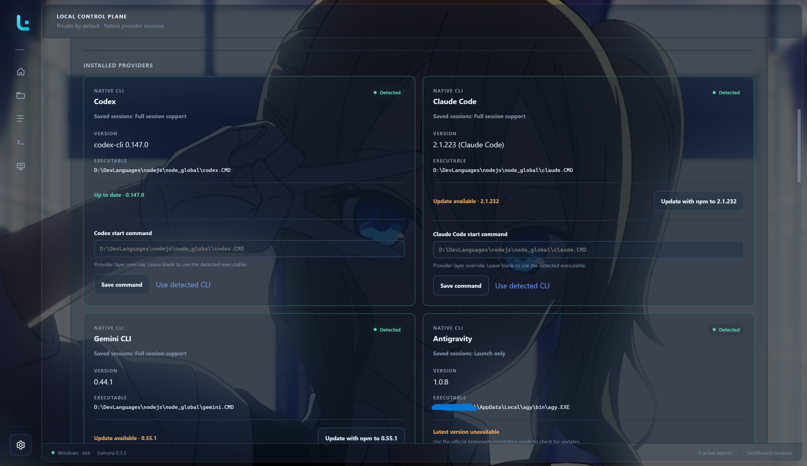
        <br><sub><strong>Installed providers</strong> — inspect versions, update eligible CLIs, and customize start commands.</sub>
      </td>
      <td width="50%" align="center">
        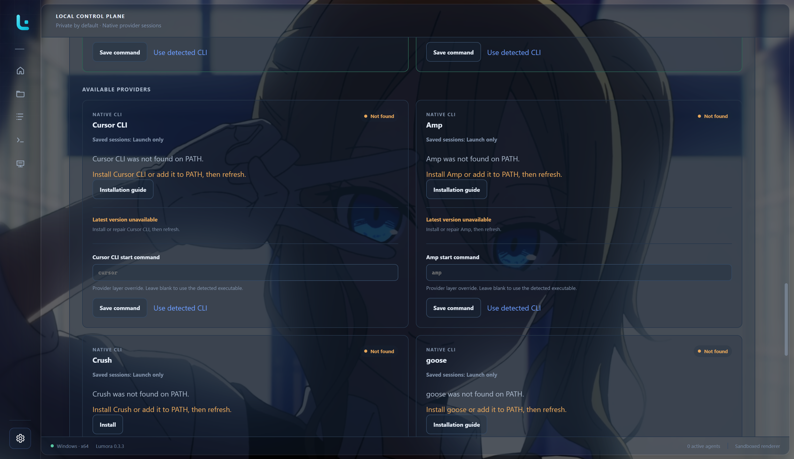
        <br><sub><strong>Missing providers</strong> — use a confirmed installer where supported or open the official guide.</sub>
      </td>
    </tr>
    <tr>
      <td colspan="2" align="center">
        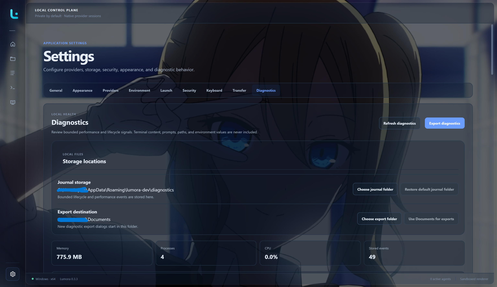
        <br><sub><strong>Diagnostics</strong> — choose local storage locations, review bounded health signals, and export a report when needed.</sub>
      </td>
    </tr>
  </table>
</details>

## Supported providers

| Provider | Install/update | New session | Saved-session discovery and exact resume | Native fork |
| --- | --- | --- | --- | --- |
| Codex | Confirmed npm action | Yes | Yes | Yes |
| Claude Code | Confirmed npm action | Yes | Yes | Yes |
| Gemini CLI | Confirmed npm action | Yes | Yes | No |
| OpenCode | Confirmed npm action | Yes | Yes | Yes |
| GitHub Copilot CLI | Confirmed npm action | Yes | Yes | No |
| Qwen Code | Confirmed npm action | Yes | Yes | No |
| Kimi Code | Confirmed npm install; official updater | Yes | Yes | No |
| Antigravity | Official guide | Yes | No | No |
| Cursor CLI | Official guide | Yes | No | No |
| Amp | Official guide | Yes | No | No |
| Crush | Confirmed npm action | Yes | No | No |
| goose | Official guide | Yes | No | No |
| Aider | Official guide | Yes | No | No |

All providers can be launched on Windows, macOS, and Linux when their command
is installed and compatible. Launch-only providers remain available in
Settings and New session, but do not appear in saved-session pages or filters.

The seven providers with complete session support can be used as handoff
sources. Codex, Claude Code, Gemini CLI, OpenCode, GitHub Copilot CLI, and Qwen
Code can also be handoff destinations. Kimi remains source-only because its
documented prompt flag is non-interactive and cannot safely create an
interactive destination session. A handoff never converts or replaces the
source provider's session.

Cross-device transfer is available as an explicit Experimental workflow for
all seven full-session providers, including Kimi Code. Kimi archives preserve
the selected native session directory and identity, exclude credentials and
global provider configuration, and require destination-workspace mapping on
import.

See [Provider support and verification](docs/PROVIDER_SUPPORT.md) for detection
commands, tested native-fork versions, and the manual release matrix.

## Data, privacy, and trust

Lumora is local-first and has no Lumora cloud synchronization. It stores
normalized session metadata, settings, trust decisions, window state, and
managed runtime history in the operating system's application-data location.
Provider session files remain provider-owned read-only inputs.

A native same-provider fork delegates context handling to the provider and does
not create a Lumora transcript copy.

Cross-agent handoff is the explicit, opt-in exception. Lumora stores an
immutable source copy, normalized conversation files, and a small manifest
under its local application-data directory. These files are used only to
bootstrap the destination provider, are not added to the searchable catalog,
and are removed according to the retention period in General settings.

Lumora does not add privacy guarantees beyond those of the provider CLI. The
provider may contact its own services according to its terms and configuration.
Remote Lumora sends bounded control and discovery requests through the user's
SSH connection to a per-user helper. Lumora does not introduce a cloud relay;
remote provider files and credentials stay on the selected remote computer.

## Current limitations

- Generic PTY processes cannot be reattached after Lumora restarts. Lumora
  reports affected runtimes and lets you resume or restart them.
- Antigravity, Cursor CLI, Amp, Crush, goose, and Aider are launch-only.
- Cross-agent handoff is opt-in and depends on provider session formats.
  Lumora preserves user and assistant messages, while compact tool-activity
  coverage can vary by provider version. A failure does not change the source
  session or prevent exact native resume.
- Provider-native authentication and approval flows must be completed inside
  the embedded terminal.
- WSL-specific orchestration, cloud sync, transcript full-text indexing, custom
  provider definitions, and complete enhanced-keyboard protocol negotiation
  are outside the current MVP. Lumora forwards provider shortcuts that xterm
  preserves. Modified Enter support is best-effort; Codex `Shift+Enter`
  multiline input remains unresolved in the embedded terminal even with
  Lumora's current compatibility sequence.
- Read-only session-content previews are deferred. The intended design is an
  on-demand Session Details view with a small normalized excerpt that neither
  resumes the provider nor imports its transcript into Lumora's catalog.
- Terminal viewport sizing remains a known issue on some layouts.
- Remote computers are experimental. New sessions and exact native resume are
  available for the seven session-managed providers on supported SSH targets;
  remote cross-agent handoff, native fork, and session transfer remain future
  phases.

## Technical documentation

- [Troubleshooting guide](docs/TROUBLESHOOTING.md)
- [Localization and Mods](docs/localization.md)
- [Cross-device session transfer](docs/SESSION_TRANSFER.md)
- [Remote computers](docs/REMOTE.md)
- [Provider support and verification](docs/PROVIDER_SUPPORT.md)
- [Architecture and privacy model](docs/ARCHITECTURE.md)
- [Development guide](docs/DEVELOPMENT.md)
- [Packaging and release guide](docs/RELEASING.md)
- [Changelog](CHANGELOG.md)

## Development

Lumora is an Electron 43, React 19, and TypeScript 6 application. Development
requires Node.js 22 or newer.

```powershell
npm ci
npm run dev
```

Before submitting a code change:

```powershell
npm run verify
```

See the [development guide](docs/DEVELOPMENT.md) for architecture boundaries,
focused test commands, provider integration rules, and packaging details.

---

<p align="center">
  Lumora is local-first, provider-native, and authored by
  <a href="https://github.com/HAYASAKA7">HAYASAKA7</a>.
</p>
