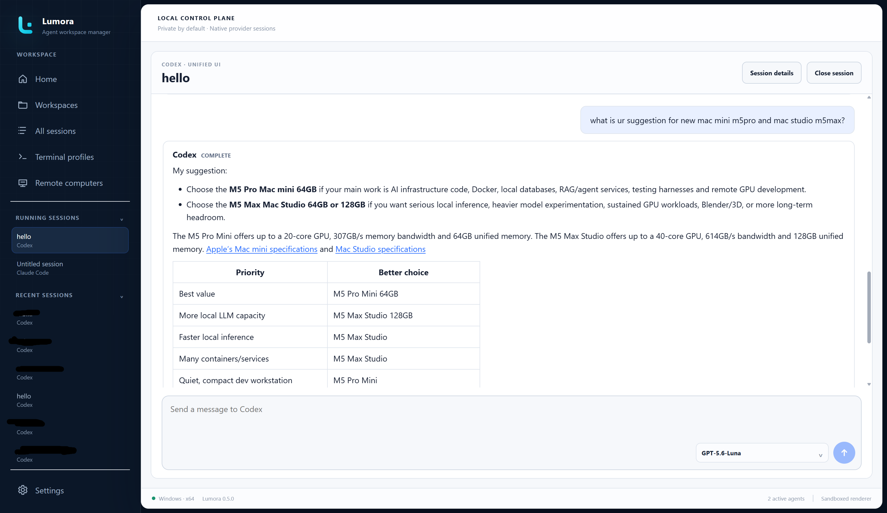

<p align="center">
  
</p>

<h1 align="center">Lumora</h1>

<p align="center">
  <strong>Your local-first command center for native AI-agent CLIs.</strong>
</p>

<p align="center">
  Find provider-owned sessions, move between projects, and run coding agents
  locally or on trusted SSH computers without replacing the provider's own
  session model.
</p>

<p align="center">
  <a href="https://github.com/HAYASAKA7/Lumora/releases"><strong>Download Lumora</strong></a>
  ·
  <a href="#quick-start">Quick start</a>
  ·
  <a href="docs/USER_GUIDE.md">User guide</a>
  ·
  <a href="docs/UNIFIED_UI.md">Unified UI</a>
  ·
  <a href="#documentation">Documentation</a>
</p>

> [!WARNING]
> Lumora 0.5 is an unsigned preview release. Review the
> [unsigned build notices](#unsigned-build-notices) before installing it.

<p align="center">
  
</p>

<!-- Demo media slot: add the current Lumora walkthrough recording here. -->

Lumora gives installed AI-agent command-line tools one desktop home for
workspaces, saved sessions, live runtimes, launch settings, cross-device
transfer, and experimental remote-computer access. Each provider keeps control
of its authentication, permissions, session files, and usage limits.

## Why Lumora

| One place to work | Provider-native sessions | Local-first control |
| --- | --- | --- |
| Move between projects, saved sessions, Unified UI conversations, native terminals, and SSH computers. | Discover and resume the provider's real session instead of importing it into a proprietary chat database. | Catalog metadata and settings remain local. There is no Lumora cloud relay or synchronization service. |
| **Flexible launches** | **Provider-aware workflows** | **Guarded automation** |
| Layer commands and environment settings globally or per provider, workspace, session, and launch. | Offer only capabilities supported by the detected provider and version, with native-terminal fallback. | Confirm workspace trust, remote identities, provider installation, transfer, and other sensitive actions. |

## Get Lumora

Download the package for your system from
[GitHub Releases](https://github.com/HAYASAKA7/Lumora/releases).

| System | Package |
| --- | --- |
| Windows x64 | `Lumora-*-win-x64.exe` |
| macOS Apple Silicon | `Lumora-*-mac-arm64.dmg` |
| macOS Intel | `Lumora-*-mac-x64.dmg` |
| Linux x64 | `Lumora-*-linux-x86_64.AppImage` |

The Windows installer lets you choose Start Menu and desktop shortcuts. The
Start Menu shortcut is selected by default; the desktop shortcut is optional.

### Unsigned build notices

The current packages are not code-signed or notarized.

- **Windows:** SmartScreen may warn about or block the installer. Confirm that
  the file came from this repository before allowing it.
- **macOS:** Gatekeeper may block the DMG or application. After verifying the
  source, use **System Settings > Privacy & Security > Open Anyway**.
- **Linux:** make the AppImage executable before opening it:

  ```bash
  chmod +x Lumora-*.AppImage
  ```

Signing, notarization, and automatic updates are planned after preview testing.

## Requirements

Lumora manages provider CLIs; it does not replace them. Your computer needs:

- Windows, macOS, or Linux;
- Node.js 22 or newer and npm; and
- at least one supported AI-agent CLI with its normal provider account and
  authentication.

Provider commands should be available on `PATH`. Lumora checks Node.js, npm,
and each enabled provider independently. A missing or incompatible provider
does not prevent healthy providers from working.

## Quick start

1. Open **Settings > Environment** and confirm Node.js and npm are available.
2. Open **Settings > Providers** and review the agents Lumora detected.
3. Install or authenticate a provider, then refresh its status.
4. Open **Workspaces** and add a project folder.
5. Select **New session**, then choose the workspace, provider, and terminal
   profile.
6. Review the effective launch and confirm trust for the exact workspace path.
7. Start the session. Lumora uses a verified local Unified UI when available
   and otherwise opens the provider's native TUI in a managed terminal.

For daily navigation, session actions, terminal behavior, clipboard controls,
and shortcuts, see [Using Lumora](docs/USER_GUIDE.md).

## Unified UI and native terminals

Lumora 0.5 introduces a local chat-style Unified UI for Codex, Claude Code,
Gemini CLI, OpenCode, Cursor CLI, GitHub Copilot CLI, Qwen Code, Kimi Code, and
goose through their provider-owned structured integrations.

<p align="center">
  
</p>

Depending on the provider, it can show streamed Markdown, commands, models,
tool and process activity, approvals, file changes, cancellation, progressively
loaded history, tokens, and account limits. Every route is capability checked.
Unavailable or failed integrations fall back to the existing native terminal.

Select a session normally to resume it directly. If the session already runs
in Lumora, the existing runtime is activated instead of opening a competing
writer. Right-click a supported stopped session to explicitly choose Unified
UI, native terminal for that launch, or advanced resume options.

Read the [Unified UI guide](docs/UNIFIED_UI.md) for provider coverage,
configuration, conversation behavior, and fallback rules. Native terminals,
terminal profiles, sidebar session lists, and shortcuts are covered in the
[user guide](docs/USER_GUIDE.md).

## Workspaces and sessions

Lumora groups provider-owned sessions by project, searches across titles and
workspaces, reports reliable provider token totals, and keeps running and
recent sessions in separate sidebar lists. Workspaces can be hidden without
deleting project or provider data.

Complete session support includes new-session launch, provider-owned metadata
discovery, catalog display, and exact native resume. Codex, Claude Code, and
OpenCode can also request provider-native forks. Optional cross-agent handoff
creates a new destination session from a temporary managed copy and never
replaces the source session. Large file-backed histories are read incrementally;
Lumora keeps bounded opening and recent context instead of loading an entire
transcript into memory.

See [Using Lumora](docs/USER_GUIDE.md#saved-sessions) and
[Provider support and verification](docs/PROVIDER_SUPPORT.md).

## Remote computers and transfer

Experimental Remote Lumora opens an isolated window for a trusted SSH target,
verifies its host identity, activates a lightweight per-user helper, discovers
remote provider metadata, and runs remote sessions through SSH PTYs. There is
no Lumora cloud relay. See [Remote computers](docs/REMOTE.md).

The separate Transfer workflow exports stopped provider-native sessions into
an encrypted-by-default `.lumora-sessions` archive. Import maps source
workspaces to directories that already exist on the destination computer and
skips duplicate native sessions instead of overwriting them. See
[Move sessions between devices](docs/SESSION_TRANSFER.md).

## Settings and customization

Settings are divided into General, Appearance, Mods, Providers, Environment,
Launch, Security, Keyboard, Transfer, Diagnostics, and About. Lumora supports
five built-in languages, installed interface and terminal fonts, managed image
backgrounds, built-in themes, and bounded data-only locale, font, and Theme
Mods.

Open **Settings > Diagnostics** to review current Lumora-owned process metrics,
recent lifecycle health, local journal storage, and privacy-safe diagnostic
export. Lumora never uploads a diagnostic report.

See [Settings and customization](docs/SETTINGS.md) for every category and
[Localization and Mods](docs/localization.md) for pack formats and safety
limits.

## Supported providers

| Provider | Install/update | New session | Saved-session discovery and exact resume | Native fork |
| --- | --- | --- | --- | --- |
| Codex | Confirmed npm action | Yes | Yes | Yes |
| Claude Code | Confirmed npm action | Yes | Yes | Yes |
| Gemini CLI | Confirmed npm action | Yes | Yes | No |
| OpenCode | Confirmed npm action | Yes | Yes | Yes |
| GitHub Copilot CLI | Confirmed npm action | Yes | Yes | No |
| Qwen Code | Confirmed npm action | Yes | Yes | No |
| Kimi Code | Confirmed npm install; official updater | Yes | Yes | No |
| Antigravity | Official guide | Yes | No | No |
| Cursor CLI | Official guide | Yes | No | No |
| Amp | Official guide | Yes | No | No |
| Crush | Confirmed npm action | Yes | No | No |
| goose | Official guide | Yes | No | No |
| Aider | Official guide | Yes | No | No |

All listed providers can be launched on Windows, macOS, and Linux when their
command is installed and compatible. Launch-only providers do not appear in
saved-session pages or provider filters. Structured UI, handoff, native-fork,
transfer, provider-version, and operating-system verification are separate
capabilities; consult the [provider matrix](docs/PROVIDER_SUPPORT.md) before
relying on one.

## Data, privacy, and trust

Lumora stores normalized session metadata, settings, trust decisions, window
state, and managed runtime history in the operating system's application-data
location. Provider session files remain provider-owned read-only inputs.

Cross-agent handoff is an explicit opt-in exception: it creates an immutable
source copy and a normalized temporary context under Lumora's local application
data, then removes it according to the configured retention period. It does not
alter the provider's source session.

Workspace trust is a consent gate, not an operating-system sandbox. Agents run
with the current user's permissions and may contact their own provider services
according to the provider's configuration and terms.

## Current limitations

- Current releases are unsigned and do not update themselves automatically.
- Generic PTY processes cannot be reattached after a full Lumora restart.
- Remote Lumora is experimental and remains PTY-based in 0.5.
- Cross-device transfer routes remain Experimental until each exact packaged
  provider/version/OS combination is manually verified.
- Custom provider definitions, Lumora cloud sync, transcript full-text search,
  and read-only session previews are not implemented.
- Codex `Shift+Enter` multiline input and terminal viewport sizing remain known
  embedded-terminal limitations on some configurations.

See [Troubleshooting Lumora](docs/TROUBLESHOOTING.md) for symptoms, recovery,
and diagnostic guidance.

## Documentation

### User guides

- [Using Lumora](docs/USER_GUIDE.md)
- [Unified UI](docs/UNIFIED_UI.md)
- [Settings and customization](docs/SETTINGS.md)
- [Remote computers](docs/REMOTE.md)
- [Move sessions between devices](docs/SESSION_TRANSFER.md)
- [Troubleshooting Lumora](docs/TROUBLESHOOTING.md)

### Reference and development

- [Provider support and verification](docs/PROVIDER_SUPPORT.md)
- [Localization and Mods](docs/localization.md)
- [Architecture and privacy model](docs/ARCHITECTURE.md)
- [Development guide](docs/DEVELOPMENT.md)
- [Packaging and release guide](docs/RELEASING.md)
- [Changelog](CHANGELOG.md)

## Development

Lumora is an Electron 43, React 19, and TypeScript 6 application. Development
requires Node.js 22 or newer.

```powershell
npm ci
npm run dev
```

Before submitting a change:

```powershell
npm run verify
```

See the [development guide](docs/DEVELOPMENT.md) for architecture boundaries,
focused test commands, provider integration rules, and packaging details.

---

<p align="center">
  Lumora is local-first, provider-native, and authored by
  <a href="https://github.com/HAYASAKA7">HAYASAKA7</a>.
</p>
