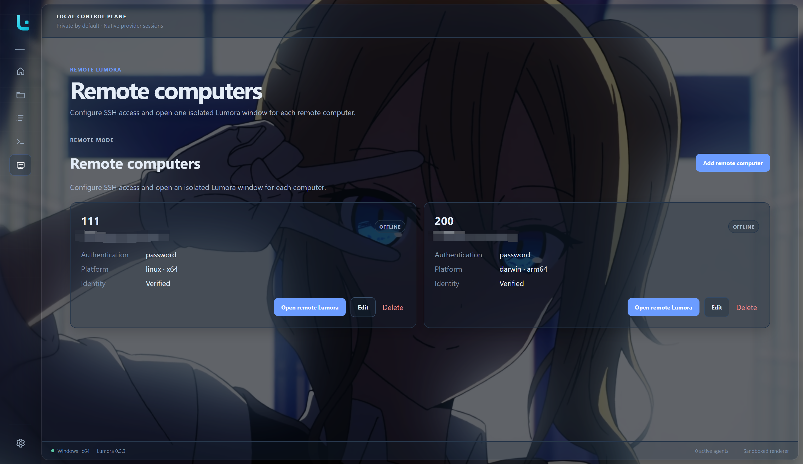

# Remote computers

Remote computers are an experimental Lumora feature. The current phase creates
an isolated remote window, verifies SSH identity, detects the remote platform,
installs and negotiates a lightweight Lumora helper, checks the remote
developer environment and enabled agent providers, and opens target-scoped
SSH terminals. After connection, the window becomes a target-scoped Lumora
shell with **Home**, **Workspaces**, **All sessions**, and **Settings**.

  

General navigation and terminal behavior follow the local application. See
[Using Lumora](USER_GUIDE.md) for shared controls and
[Settings and customization](SETTINGS.md) for global-versus-target settings.

## Connect a computer

1. Open the separate **Remote** entrance in the lower sidebar.
2. Add a direct SSH profile or an SSH-config host.
3. Observe the SHA-256 host fingerprint and compare it with the remote computer
   through a trusted channel.
4. Trust the fingerprint only when it matches.
5. Open the isolated remote window and connect with the configured password,
   private key, or SSH agent method.

  

Profiles can be edited or deleted from the local Remote page. Lumora closes the
profile's isolated window and active SSH/helper resources before either
mutation. Deletion requires an in-app confirmation and never removes files from
the remote computer.

Passwords and private-key passphrases remain connection-only by default. Each
profile can instead enable **Remember password** or **Remember passphrase**.
Lumora saves only an operating-system-protected encrypted value and never logs
or exposes it after submission. The remember control is unavailable when the
operating system cannot provide secure credential storage; Lumora does not fall
back to plain text. Turning the remember switch off deletes that profile's
encrypted credential immediately but does not modify the remote computer.

**Connect automatically** is also off by default and belongs to one profile.
It supports password, private-key, and SSH-agent authentication. Password-based
automatic connection becomes available after the password is selected for
remembering; an unencrypted private key or SSH agent needs no saved secret.
Opening the isolated remote window makes one automatic attempt. A failure does
not loop, hide the manual controls, or bypass host-fingerprint verification.
With automatic connection off, selecting **Connect** reuses a remembered
credential inside the main process; the saved value is never prefilled or sent
back to the remote window.

## Close and reopen a remote window

Closing an isolated remote window keeps its ready SSH connection, helper, and
running agents alive in the main Lumora process by default. Reopening the same
computer restores the cached environment, provider catalog, sessions, and
active terminal state immediately. Use the normal refresh controls when a new
remote scan is needed.

Enable **Settings > General > Disconnect when a remote window closes** when a
window close should also end that computer's connection. If remote terminals
are still active, Lumora asks whether to **Keep running** or **Disconnect and
close** before doing anything. Disconnecting stops the target's managed remote
resources; keeping them running closes only the window.

The connection state on the main **Remote** page updates while isolated windows
connect or disconnect. A status dot on the Remote sidebar entrance also appears
whenever at least one remote computer is ready.

## Activate the helper

After SSH authentication, Lumora probes the remote operating system and
architecture. Supported helper targets are:

| Remote OS | Architectures |
| --- | --- |
| Windows | x64, arm64 |
| macOS | x64, arm64 |
| Linux | x64, arm64 |

If the helper is missing or invalid, the remote window displays the packaged
version and exact per-user install location. Installation begins only after an
explicit confirmation. Lumora uploads a temporary copy, verifies its size and
SHA-256 digest on the remote computer, applies executable permissions on Unix,
and atomically activates it. An invalid existing helper is not replaced until
the new upload has passed verification.

  

The helper runs only while Lumora has an active remote connection and consumes
minimal resources. It requires no administrator service, background daemon, or
open inbound port; communication stays inside the existing SSH channel.

## Check the remote environment

After the target reaches `ready`, open **Settings**, then use its
**Environment** and **Providers** categories. Lumora checks remote Node.js, npm,
and only the providers enabled for that target. Results include the resolved
executable path and version when available. **Security** contains the target's
platform, architecture, home directory, shell, and connection controls.

Provider choices belong to the remote target and do not change local provider
settings. At least one provider must remain enabled. Saving a provider selection
starts a new scan, and **Refresh** repeats the scan without reconnecting.

The Providers category reuses the local Lumora provider cards. Each card can
save a target-specific start command, check public release metadata, and show
only the lifecycle actions supported by that provider. For an allowlisted
npm-based provider, **Install** or **Update** requires an explicit confirmation
before the helper runs the fixed global npm package action. Lumora does not use
`sudo`, request elevation, edit shell profiles, or return raw command output.
Providers that require an official installer keep their installation-guide
action instead.

## Browse remote sessions

After the target reaches `ready`, Lumora performs one bounded catalog scan for
the connected shell. **Home** shows recent remote sessions, **Workspaces**
groups them by provider-owned remote paths, and **All sessions** provides the
same search and provider filtering used by local Lumora. **Refresh catalog**
repeats the scan. The catalog includes only read-only metadata: native session
ID, title, timestamps, workspace path, and an all-time token count when the
provider exposes one.

Provider catalog coverage is explicit in the page:

| Provider | Remote catalog status |
| --- | --- |
| Codex | Native app-server thread metadata |
| OpenCode | Bounded database query with native list fallback |
| Claude Code | Bounded provider-owned project recording metadata |
| Gemini CLI | Bounded provider-owned project chat metadata |
| GitHub Copilot CLI | Bounded event or legacy workspace metadata |
| Qwen Code | Bounded provider-owned project recording metadata |

An installed provider with no available executable is shown as unavailable.
Unsupported adapters are not reported as an empty successful catalog. Results
are paginated across bounded helper frames and combined in the main process;
raw session files and transcript contents never cross the SSH helper protocol.
Session cards expose exact same-provider resume, and the remote top bar exposes
New session when an available workspace exists. Both workflows use the shared
Lumora confirmation dialogs and open a managed terminal without leaving the
isolated remote window.

## Start and resume remote sessions

Remote new-session and exact-resume workflows are available for Codex, Claude
Code, Gemini CLI, OpenCode, GitHub Copilot CLI, and Qwen Code when the provider
is enabled and detected on the target. A launch refreshes the remote catalog,
revalidates the provider executable and workspace in the main process, and asks
for trust before starting in an untrusted remote workspace.

Open **Settings > Launch** inside the remote window to choose detected or
custom command mode for each enabled provider. These commands belong only to
that remote computer. For example, a target can launch Codex through a shell
alias or wrapper while local Lumora continues to use the detected `codex`
executable. A blank custom command is never sent.

Each session runs in its own SSH PTY. Lumora keeps terminal tabs mounted across
remote navigation, forwards input and resize events, supports the shared stop
workflow, reconciles newly created provider sessions back into the remote
catalog, and closes resources safely on disconnect or application shutdown.
Remote cross-agent handoff, provider-native fork, and cross-device transfer are
not mapped onto resume and remain unavailable in this experimental phase.

The isolated window follows Lumora's global Appearance settings, including the
theme, managed background, opacity hierarchy, and surface mosaic. Appearance
can only be changed in the local window; refocusing an isolated window refreshes
its read-only presentation.

If the SSH transport closes after the shell has opened, Lumora releases the
remote helper and file-transfer resources, marks the target offline, and keeps
the current page and cached catalog visible. An emphasized reconnect banner is
shown instead of replacing the shell with a blank connection page.

Environment and session discovery remain read-only. Lumora does not install,
update, or repair Node.js or npm. Provider lifecycle actions are limited to
generated, allowlisted npm package identifiers and run only after confirmation;
all other provider installation methods remain manual. The helper uses bounded
version probes and lifecycle output, and never returns environment variables,
tokens, raw installer output, or provider session contents.

## Current states

- `offline`: no active SSH connection.
- `connecting` / `authenticating`: SSH setup is in progress.
- `helper-missing`: authentication succeeded and confirmation is needed.
- `helper-incompatible`: an invalid or incompatible helper can be safely
  replaced after confirmation.
- `ready`: the verified helper completed its protocol handshake.
- `error`: the connection failed safely; credentials and private diagnostics
  are not returned to the renderer.

## Manual test checklist

- Add direct and SSH-config profiles and confirm both remember and automatic
  connection are off by default.
- Remember a password and a private-key passphrase, reconnect successfully,
  then turn remembering off and confirm the next connection asks again.
- Enable automatic connection for password, private-key, and SSH-agent
  profiles; confirm each remote window makes one attempt and leaves manual
  recovery visible after failure.
- Close a ready remote window with the default close behavior, confirm its card
  and sidebar indicator remain online, then reopen it and confirm cached
  environment, catalog, sessions, and active terminals appear without a new
  scan.
- Enable **Disconnect when a remote window closes**, close a target with no
  active terminals, and confirm its Remote card and sidebar indicator update
  immediately. Repeat with an active terminal and test both **Keep running**
  and **Disconnect and close** in the warning dialog.
- Confirm remembering is disabled when secure OS storage is unavailable and
  that no plain-text secret appears in the profile or routine logs.
- Edit and delete disconnected profiles; confirm open target windows and SSH
  resources close before the profile changes.
- Reject an untrusted or changed host fingerprint.
- Connect each configured authentication method.
- Confirm that Cancel performs no installation.
- Install on a clean account and verify the state becomes `ready`.
- Corrupt a helper copy and verify Lumora requires confirmed replacement.
- Confirm Environment reports remote Node.js/npm paths and versions.
- Enable and disable providers, save, and confirm only enabled providers are
  scanned. Confirm at least one provider must remain enabled.
- Save and reset a target-specific start command from **Settings > Providers**;
  confirm local provider commands do not change.
- Confirm an allowlisted missing npm provider, install it, and verify the card
  rescans to Detected. Check and apply an available update the same way.
- Cancel both lifecycle confirmations and verify no remote command runs. Confirm
  guide-only providers open their shipped official URL instead.
- Confirm lifecycle failures show a bounded Lumora message without raw npm or
  remote shell output, and that the SSH connection remains usable.
- Confirm a ready connection transitions into the shared Lumora shell with
  Home, Workspaces, All sessions, and Settings, without Terminal profiles or
  local Remote-computer management.
- With each enabled session provider installed, confirm Home recent sessions,
  workspace grouping, All sessions filtering, and Refresh catalog update
  renamed or new sessions.
- Confirm a provider-wide scan failure is shown separately from an unavailable
  executable or a successful empty catalog, without blocking other providers.
- For each available managed provider, start a new session, enter interactive
  input, resize its terminal, switch tabs, stop or exit it, and confirm the new
  native session appears after catalog refresh.
- Resume an existing session from Home, a workspace, and All sessions; confirm
  the provider opens the exact native session rather than creating a second
  one.
- Set a target-specific custom start command under **Settings > Launch** and
  confirm the remote provider uses it while local Lumora settings are unchanged.
- Confirm no transcript text, command output, environment value, or helper-only
  source key appears in the remote window.
- Disconnect from missing, incompatible, and ready states.
- Drop the SSH transport after opening a catalog page and confirm the page and
  cached data remain visible under the reconnect banner.
- Test local/remote OS combinations independently where machines are available.
- Close Lumora and confirm the SSH channel and helper process stop cleanly.
- Change global Appearance settings, refocus the isolated window, and confirm
  its theme and surfaces update without exposing appearance controls remotely.

See [Troubleshooting](TROUBLESHOOTING.md#remote-computers) when a target cannot
reach the ready state.
