# Lumora settings and customization

Lumora groups settings by purpose instead of placing every control on one long
page. Open **Settings** with the sidebar action or `Ctrl+,`.

General behavior and appearance are global across local and Remote Lumora.
Provider selection, launch values, workspace visibility and trust, terminal
state, and remote credentials remain isolated to the relevant local or remote
target.

## General

General controls language, startup and window behavior, sidebar behavior,
informational notices, agent-exit warnings, cross-agent handoff, and other
shared application preferences.

<p align="center">
  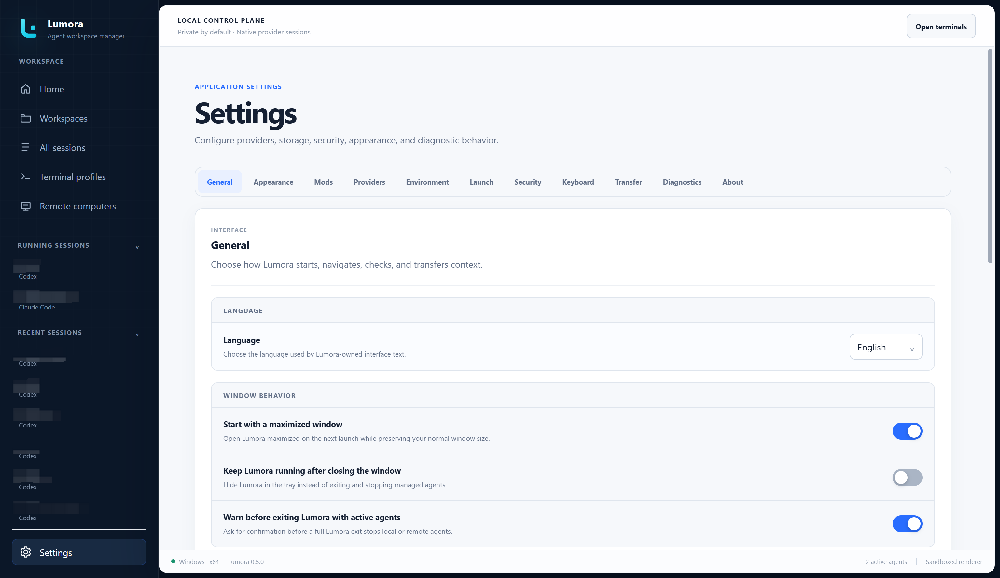
</p>

Lumora follows a supported operating-system language on first use and otherwise
falls back to English. The explicit choices are English, Simplified Chinese,
Traditional Chinese, Japanese, and Korean.

Choose whether closing the main window exits Lumora or hides it in the tray.
Full-exit and remote disconnect-and-close warnings use separate switches.
Cross-agent handoff is off by default; its retention value controls temporary
managed-copy cleanup when the feature is enabled.

## Appearance

Choose Lumora mixed, Light, Dark, or a validated Theme Mod. Lumora mixed is the
default. A separate terminal preference lets developers keep terminal content
dark under a light application theme.

<p align="center">
  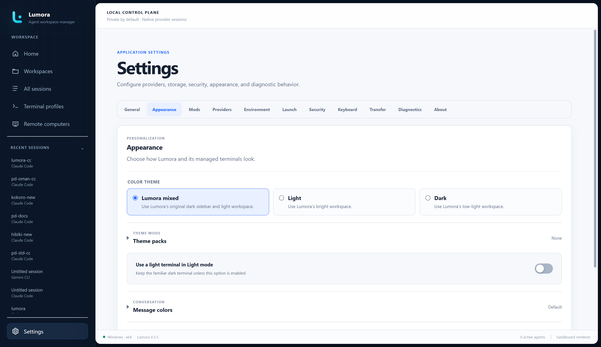
</p>

Theme packs, message colors, fonts, and the workspace image each fold to their
heading, showing their current value beside it, so the page stays short. Lumora
remembers which sections were open. The color theme is always visible, and an
open section keeps its controls on the page so a live preview still shows
through.

Appearance also supports:

- independent installed interface and terminal fonts;
- terminal text size, applied to terminals that are already open;
- data-only font presets;
- PNG, JPEG, or WebP managed backgrounds;
- image opacity, brightness, blur, fit, and position;
- surface, terminal, and dialog opacity tiers; and
- an optional surface mosaic effect.

Changes apply to local and Remote Lumora windows. Remote windows use fonts
installed on the local computer that renders them.

## Mods

Mods are bounded, data-only customization packs. They cannot execute code.
The configured Mods root contains locale, font, and theme folders.

<p align="center">
  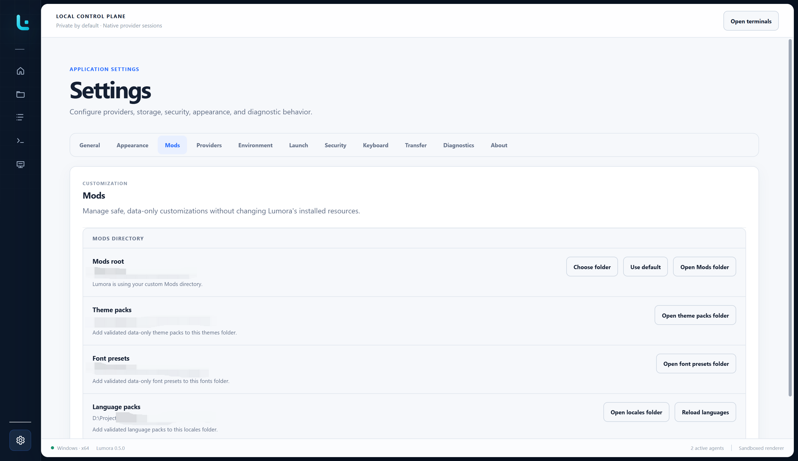
</p>

Changing the Mods path does not move or delete the existing folder. Invalid
packs are isolated and the last valid catalog or safe built-in fallback remains
active. See [Localization and Mods](localization.md) for manifests, schemas,
limits, and recovery.

## Providers

Every provider Lumora supports has one card, whether or not it is installed.
The card carries the detected version, a switch that decides whether Lumora
scans and offers that provider, an update button when a newer release exists,
and **Details**. A provider that is switched off keeps its card, so it can
always be switched back on. At least one provider stays enabled.

**Details** opens a dialog holding the rest: the detected command and installed
path, whether the provider supports saved sessions, its release state, any
diagnostic from the last scan, and the provider-specific start command.

Installing or updating a provider asks for confirmation in a dialog naming the
version it will move to, rather than expanding the card.

**Refresh** re-probes every enabled provider rather than reusing the last
result, so a provider that failed to be detected once can be re-checked without
restarting Lumora.

<p align="center">
  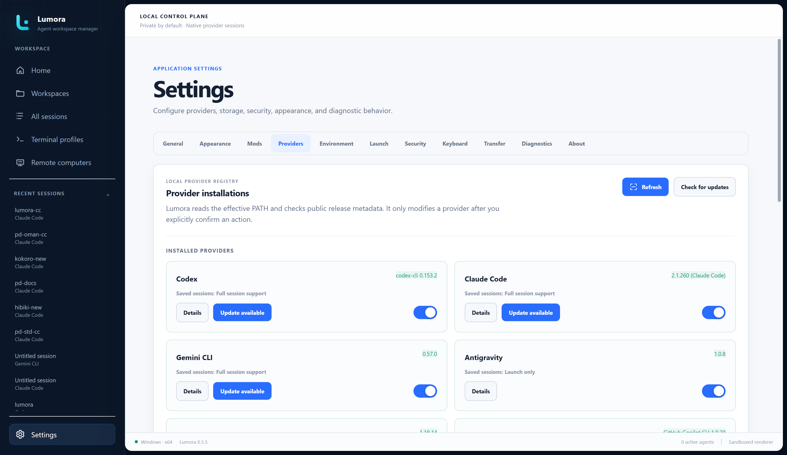
</p>

The local Providers page also contains the Unified UI master switch and its
detailed capability dialog. See the [Unified UI guide](UNIFIED_UI.md#enable-unified-ui)
and [provider support matrix](PROVIDER_SUPPORT.md).

An update in progress can be cancelled, which stops the package manager
process Lumora started rather than only clearing the progress indicator.
Lumora re-reads the provider afterwards, because an install stopped partway can
leave a different version on disk than the one shown.

Updating a provider that is currently running fails on Windows, because its
files cannot be replaced while in use. Lumora reports that specific cause and
asks for the running sessions to be closed first.

Provider installation never installs Node.js for the user. Remote provider
lifecycle actions run only on the connected target, use fixed allowlisted
package identifiers, require confirmation, and do not request elevation.

## Environment

Environment checks Node.js and npm independently and reports their resolved
paths and versions. Lumora requires Node.js 22 or newer locally. A missing tool
links to the official installation source rather than modifying the computer.

<p align="center">
  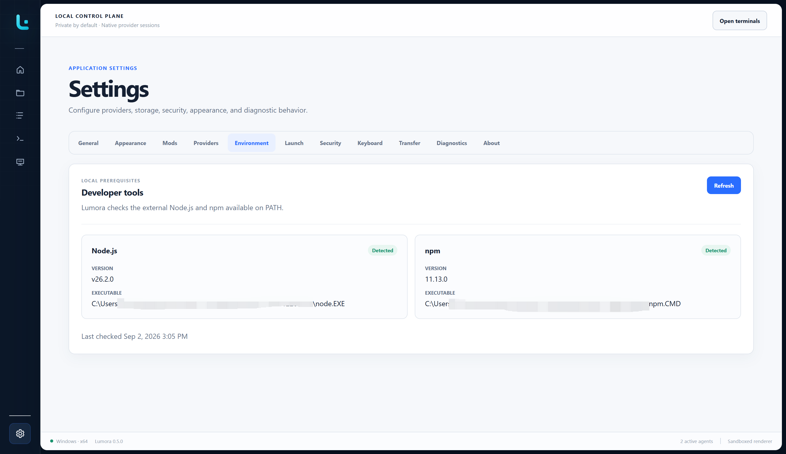
</p>

Remote checks use the target's login-shell environment and remain read-only;
Lumora does not install or repair Node.js or npm remotely.

## Launch

Launch settings layer commands, working directories, profiles, and environment
values with increasing precedence:

```text
Global < Provider < Workspace < Session < One-time launch
```

<p align="center">
  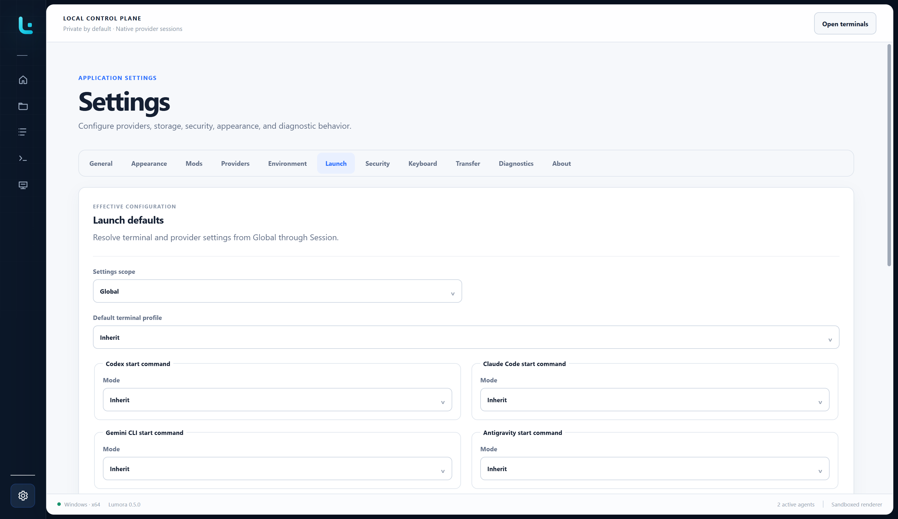
</p>

The launch preview shows which layer supplied every effective value. Use the
Providers page for a provider's normal start command and Launch for wider
layered overrides.

## Security

Security manages trusted workspace paths and the optional automatic-trust
preference. Trust applies to an exact canonical path and can be revoked.

<p align="center">
  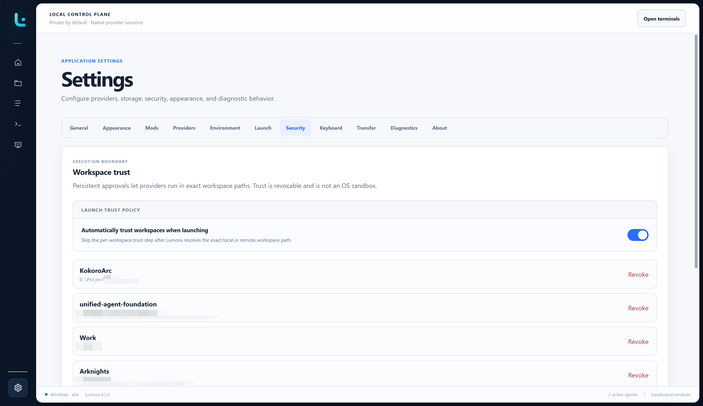
</p>

Enabling **Automatically trust workspaces** requires a second explicit
confirmation. Workspace trust is a consent gate, not an operating-system
sandbox; the agent still runs with the user's account permissions.

Remote Security also shows the target platform, architecture, home directory,
shell, connection behavior, and host identity. Remote trust decisions remain
isolated from local ones.

## Keyboard

Application shortcuts can be recorded and changed. Lumora does not use
browser-style Tab navigation; editable controls keep focus and managed
terminals receive native Tab input.

<p align="center">
  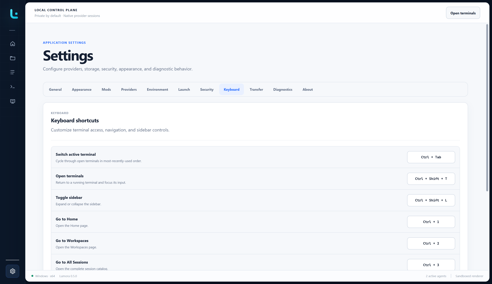
</p>

See the [default shortcut table](USER_GUIDE.md#default-keyboard-shortcuts).

## Transfer

Transfer opens the guarded provider-native export and import workflow. Routes
are labeled Supported, Experimental, or Not verified according to exact
provider, version, and operating-system evidence.

<p align="center">
  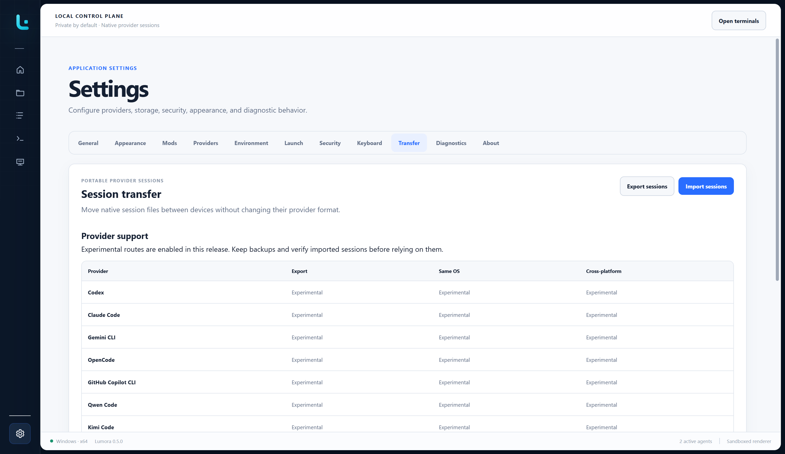
</p>

See [Move sessions between devices](SESSION_TRANSFER.md) before exporting or
importing session files.

## Diagnostics

Diagnostics shows current Lumora-owned runtime and Electron process metrics,
recent lifecycle events, abnormal-shutdown state, journal storage, and local
export controls.

<p align="center">
  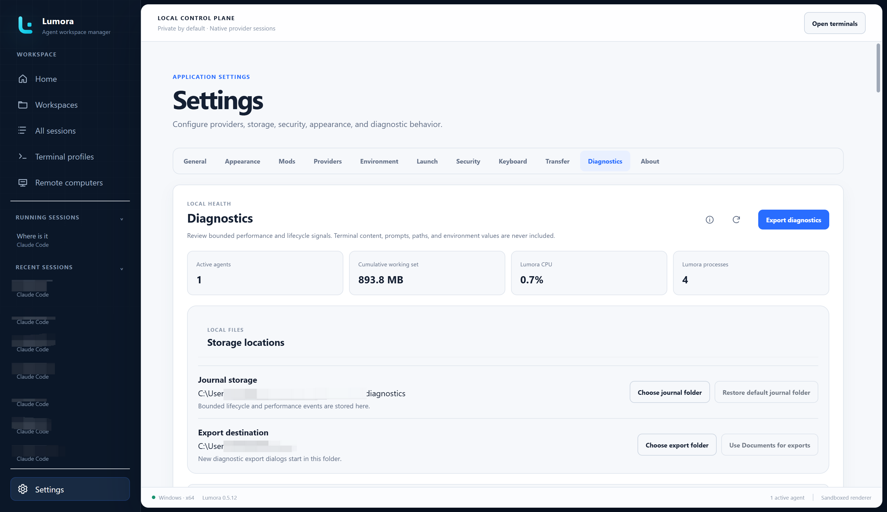
</p>

The bounded journal excludes prompts, terminal output, session content,
credentials, environment values, and filesystem paths. Lumora never uploads a
diagnostic report. Choosing **Export diagnostics** always lets the user select
the destination filename and folder.

## About

About shows the installed Lumora version, developer, and local platform.
Remote Lumora also shows the connected helper and remote platform.

<p align="center">
  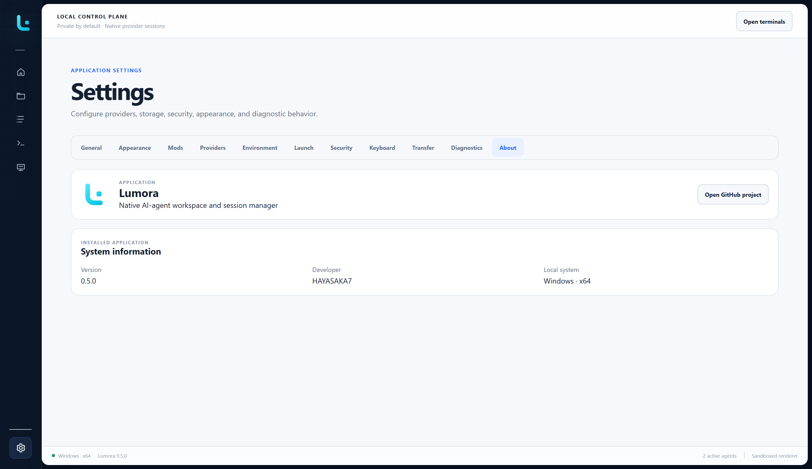
</p>

Lumora checks public GitHub release metadata in the background and shows
**View update** only when a newer stable release exists. Unsigned editions do
not download or install updates automatically.

## Related guides

- [Using Lumora](USER_GUIDE.md)
- [Unified UI](UNIFIED_UI.md)
- [Remote computers](REMOTE.md)
- [Provider support and verification](PROVIDER_SUPPORT.md)
- [Troubleshooting Lumora](TROUBLESHOOTING.md)
