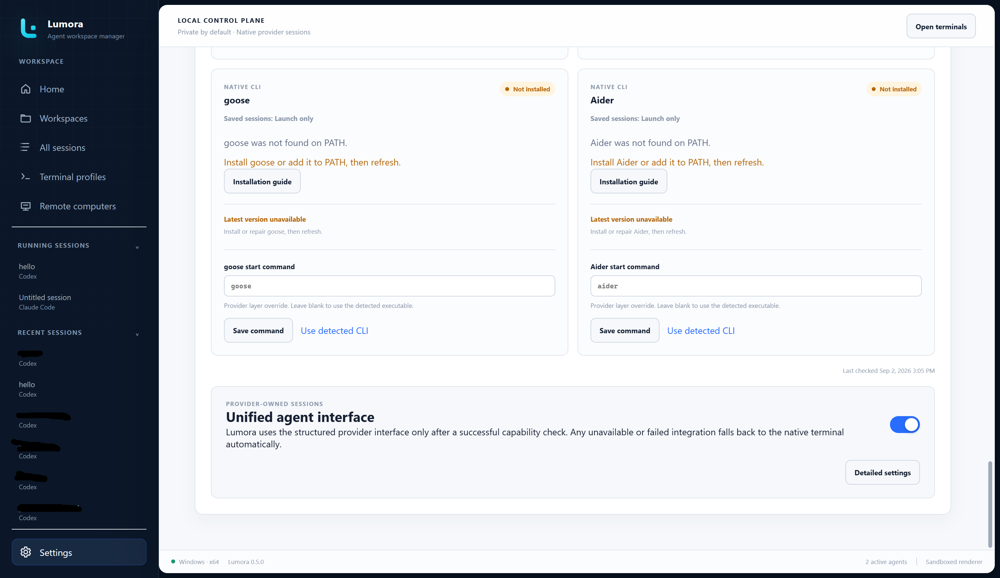
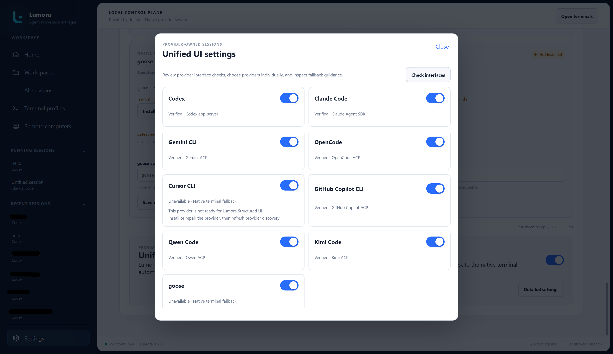
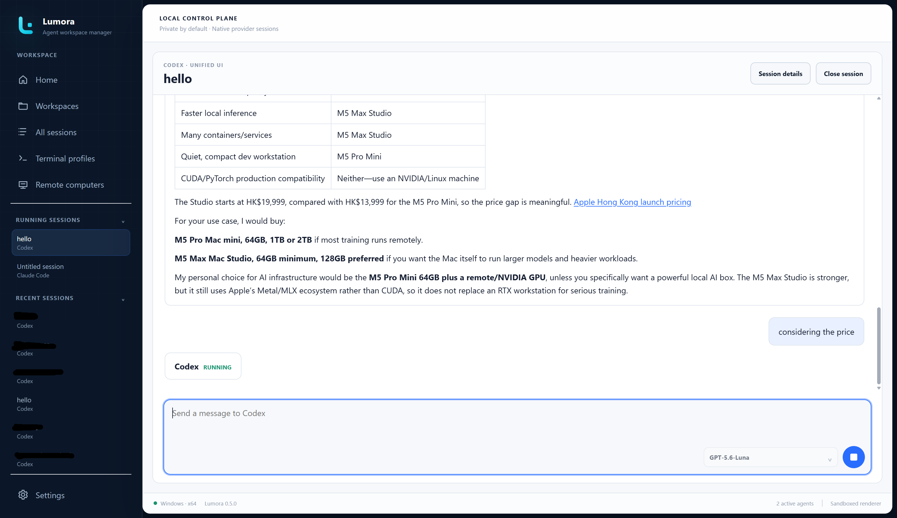
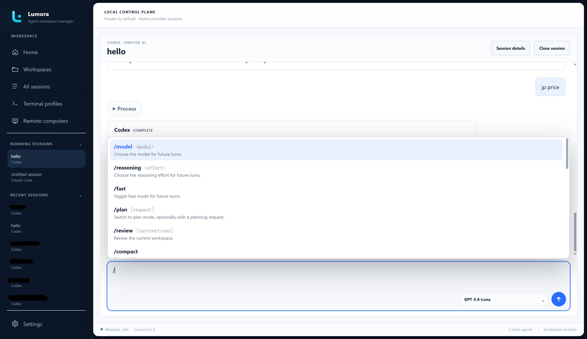
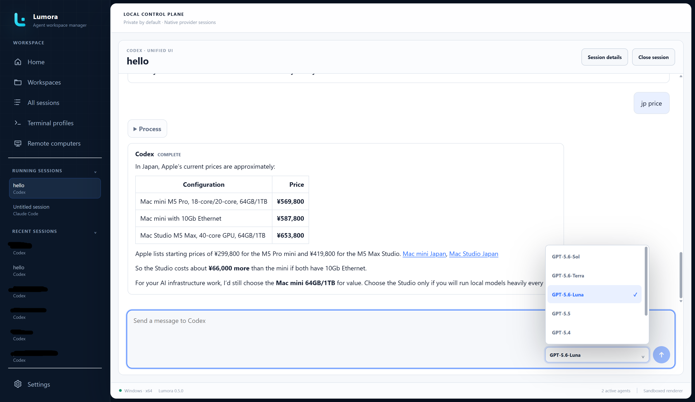
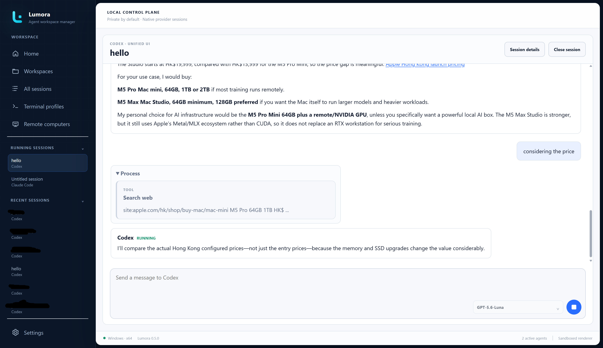
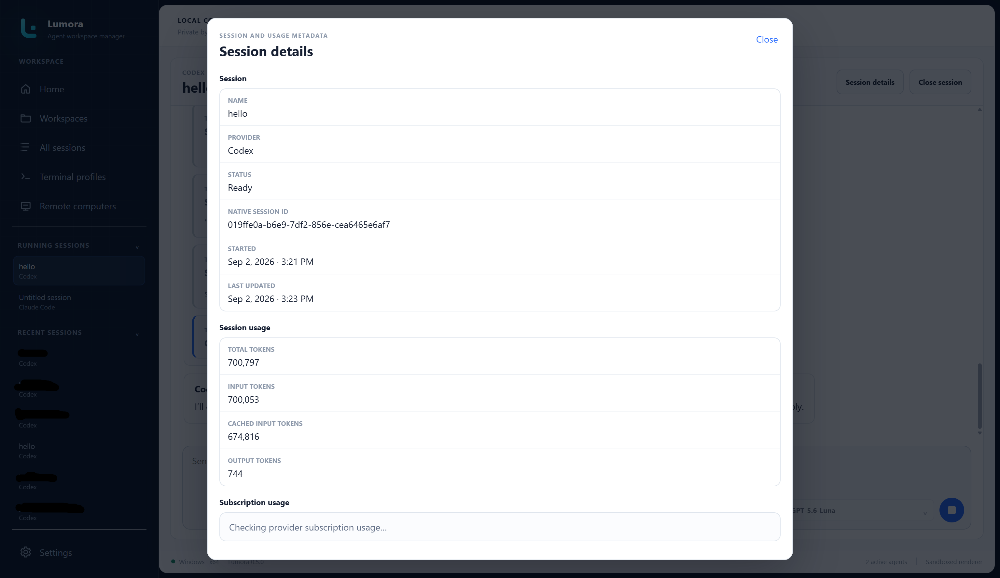

# Lumora Unified UI

Lumora 0.5 adds a local chat-style interface for providers that expose a
structured protocol. It complements the native terminal; it does not replace
provider-owned sessions, authentication, permissions, or the terminal fallback.

Remote Lumora remains PTY-based in 0.5. The settings and capability results in
this guide apply only to local Lumora.

## Supported integrations

| Provider | Integration | Unified UI route |
| --- | --- | --- |
| Codex | App-server protocol | New session and exact resume |
| Claude Code | Claude Agent SDK | New session and exact resume |
| Gemini CLI | ACP | New session and exact resume |
| OpenCode | ACP | New session and exact resume |
| Cursor CLI | ACP | New sessions |
| GitHub Copilot CLI | ACP | New session and exact resume |
| Qwen Code | ACP | New session and exact resume |
| Kimi Code | ACP | New session and exact resume |
| goose | ACP | New sessions |

Cursor CLI and goose remain launch-only catalog providers, so Lumora can open
a verified new Unified UI session but does not claim provider-owned saved-session
discovery or exact resume for them. Antigravity, Amp, Crush, and Aider remain
native-terminal-only.

The current executable and provider version must pass Lumora's capability
check. An installed command name alone does not verify a structured route.

## Enable Unified UI

Open **Settings > Providers** and turn on the target-scoped **Unified agent
interface** master switch.

  

Select **Detailed settings** to check the installed interfaces and choose
providers individually. Provider start commands remain in their installation
cards; Lumora does not duplicate them in the Unified UI dialog.

  

Turning off the master switch forces automatic launches through the native PTY
without deleting the saved per-provider choices.

## Open a session

Select a supported saved session normally. Lumora begins the direct resume flow
immediately, keeps preparation inside the terminal workspace, and leaves other
pages usable while the provider connects.

When a session is already active, Lumora returns to its existing runtime rather
than opening a second writer. For a stopped session, right-click to explicitly
choose **Open in Unified UI**, **Open in native terminal**, or **Resume
options…**. The explicit native-terminal route changes only that launch.

If a capability check or structured launch fails before ownership is
established, Lumora falls back to the validated native terminal route. Native
forks, cross-agent handoffs, and structured actions a provider does not expose
remain PTY-based.

## Conversation workspace

The Unified UI renders provider responses as Markdown and keeps the provider
name and turn state with each agent message. The composer remains independent
from conversation height and keeps focus after sending.

  

During a turn, the status changes to Running and the Send control becomes a
stop control. Cancelling requests provider cancellation through the structured
transport; it does not terminate the whole Lumora application.

  

Lumora follows new output while the user remains at the latest content. If the
user scrolls upward, automatic following pauses so earlier content stays in
place. Long sessions initially load a small, content-bounded recent window;
scrolling upward progressively requests earlier turns instead of rendering the
entire transcript at once.

## Commands and models

Type `/` to open the provider's available command list. Lumora shows commands
advertised by the active integration rather than inventing a shared command
language. Command results remain provider-owned structured events.

  

When the provider exposes model configuration, use the selector inside the
composer. A successful change applies to future turns and is reconciled with
the provider state when the session is resumed.

  

Not every provider exposes the same models, commands, reasoning controls, or
account information. Lumora hides unavailable controls instead of presenting
an unsupported imitation.

## Process, tools, approvals, and file changes

Provider commands, tool calls, approvals, and related operations share the
collapsible **Process** entry. Agent messages remain in the conversation while
implementation activity can be expanded only when needed.

  

When a provider reports changed files, Lumora presents its structured file
changes and diffs without reading arbitrary workspace files from the renderer.
Approval requests stay associated with the provider turn and must be answered
before the provider continues.

## Session details

Select **Session details** to inspect normalized metadata such as provider,
native session identity, timestamps, token totals, context, and subscription
usage when available. The details surface does not parse terminal text to guess
missing provider data.

  

## Lifecycle and fallback

- Closing a loading surface cancels its pending structured launch and any late
  native-terminal fallback.
- Closing an active Unified UI session asks the provider runtime to exit and
  releases its one-writer ownership.
- A first-response, command, or reconnect failure is handled inside the session
  view without blocking navigation elsewhere in Lumora.
- If the provider integration is unavailable, incompatible, disabled, timed
  out, or fails before it owns the session, Lumora uses the native PTY.
- Selecting an already-running session always returns to the current Lumora
  runtime, regardless of where its card was selected.

For provider-specific status and manual verification, see
[Provider support and verification](PROVIDER_SUPPORT.md). For terminal fallback
behavior, see [Using Lumora](USER_GUIDE.md#managed-native-terminals).

## Security boundary

Structured provider processes and session data stay in Electron's main process
behind schema-validated IPC, bounded transports, expiring launch tokens,
capability checks, workspace trust, workspace-confined file access, and
one-writer session ownership. The sandboxed renderer receives normalized
events rather than direct process or filesystem access.
