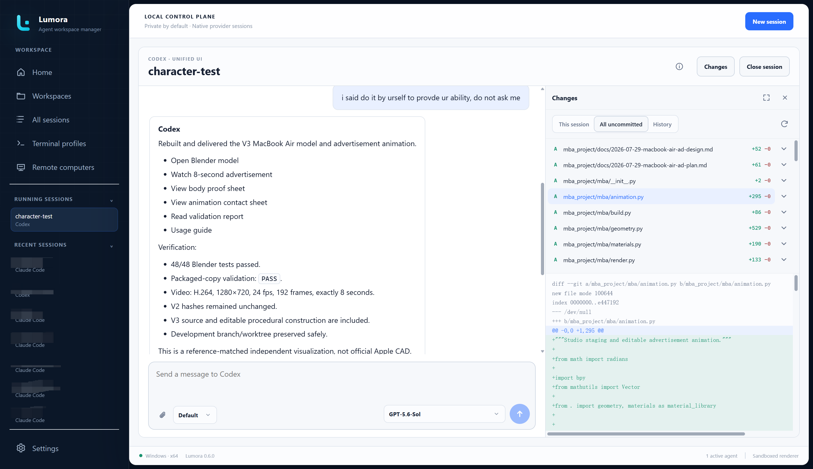
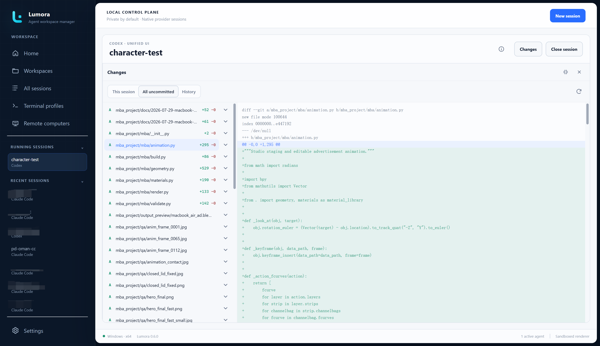
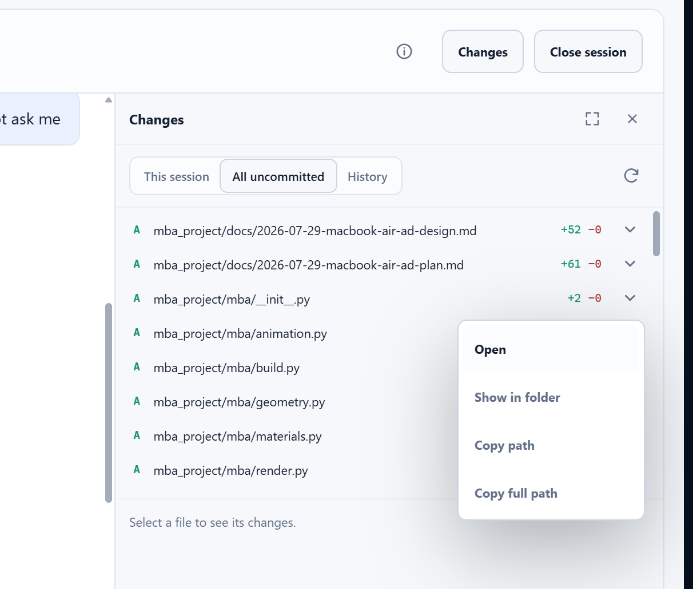
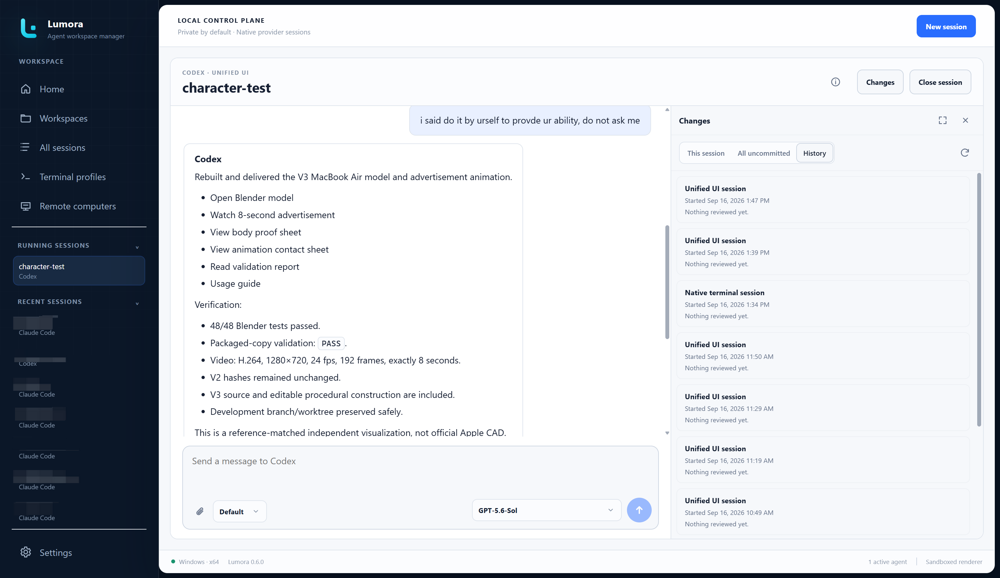
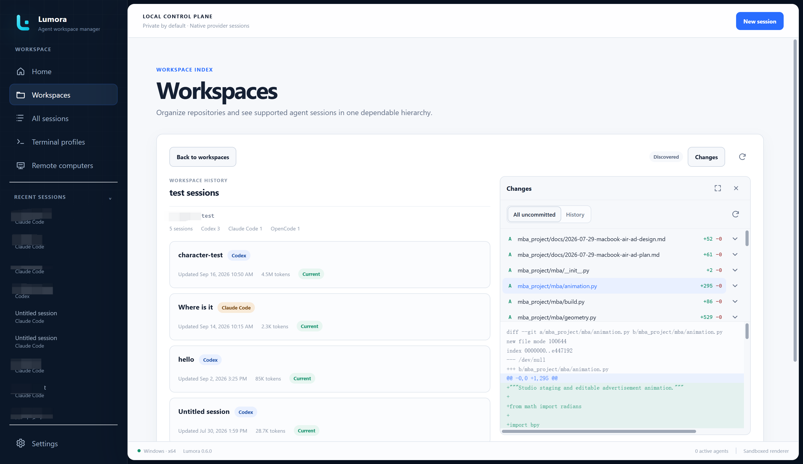

# Using Lumora

Lumora is a local-first desktop workspace for installed AI-agent command-line
tools. It discovers provider-owned sessions, groups them by workspace, and
runs agents in either Lumora's local Unified UI or a managed native terminal.
The provider continues to own authentication, session files, permissions, and
usage limits.

For installation and system requirements, start with the
[README](../README.md#get-lumora).

## First run

1. Open **Settings > Environment** and confirm Node.js and npm are available.
2. Open **Settings > Providers**, switch on the agents you want Lumora to scan,
   and review their detected versions. **Details** on a card shows where the
   provider was found and lets you set its start command.
3. Install or authenticate each provider using its supported Lumora action or
   official instructions.
4. Open **Workspaces**, add a project directory, then select **New session**.
5. Choose a provider and terminal profile, review the effective launch, and
   confirm trust for the exact workspace path.

Every provider is optional. A missing or incompatible provider does not stop
healthy providers from working.

## Home and the sidebar

Home summarizes running agents, recent provider-owned sessions, catalog
health, and provider updates that need attention.

**Needs attention** reports one count. **View details** beside it opens a
dialog listing each catalog issue with what it affects and how to clear it,
and every lost runtime with its recovery action.

<p align="center">
  
</p>

The expanded sidebar keeps **Running sessions** separate from **Recent
sessions**. Running sessions open their existing Lumora runtime. Recent
sessions use the normal resume route. Each list can be collapsed independently
and refreshes when a managed runtime exits. The recent list loads progressively
as it scrolls.

A session counts as running whether it runs in a native terminal or in the
Unified UI, and it appears as soon as it starts rather than once the provider
finishes connecting. The same total is shown by **Running agents** on Home, the
status bar, the tray menu, and **Active agents** in Diagnostics.

Collapse the main sidebar to keep only navigation icons. Session lists then
disappear and the terminal tab strip becomes the primary session switcher.
Lumora remembers the sidebar state across application launches.

## Workspaces

The Workspaces page groups provider-owned sessions by project directory.
Search filters the visible cards without changing the catalog.

<p align="center">
  
</p>

Select a workspace card to open its session list. Starting a new session from
that page preselects the current workspace.

<p align="center">
  
</p>

To remove an old project from everyday navigation without deleting it, choose
**Hide workspace** from the workspace actions. You can hide only the workspace
card while retaining its sessions, or hide the workspace and its sessions.
Use **Hidden workspaces** to search, select, and restore hidden entries.

Lumora never deletes the project directory or provider-owned session data when
a workspace is hidden.

## Saved sessions

All Sessions searches across titles and workspaces and filters by installed,
enabled providers for which Lumora found sessions. Token totals appear when a
provider exposes reliable all-time usage metadata.

Session names and workspaces are owned by the provider, so renaming a session
inside the provider is reflected in Lumora on the next catalog refresh. A
session stays grouped under the workspace it started in even when the agent
later works in other folders, such as a git worktree or a subdirectory, because
that is the workspace the provider resumes it from.

<p align="center">
  
</p>

Select a stopped session to resume it directly. Lumora:

- returns to the existing runtime when that provider session is already
  running in Lumora;
- uses the verified local Unified UI when it is enabled for the provider; or
- resumes through a managed native terminal when Unified UI is unavailable or
  disabled.

Right-click a stopped session to choose an explicit route. **Open in native
terminal** affects that launch only and does not overwrite the saved Unified UI
preference. **Resume options…** opens the advanced workflow for provider-native
fork, cross-agent handoff, an initial task, or one-time launch overrides.

<p align="center">
  
</p>

Codex, Claude Code, and OpenCode support provider-native forks when the
installed version meets Lumora's tested minimum. Cross-agent handoff is a
separate opt-in workflow: it creates a new destination-provider session from a
temporary managed copy and leaves the source session unchanged. For a large
file-backed history, Lumora retains bounded opening and recent conversation
context and reports when older content was condensed.

See [Provider support and verification](PROVIDER_SUPPORT.md) for the exact
capability matrix and [Move sessions between devices](SESSION_TRANSFER.md) for
export and import.

## Start a new session

Select **New session**, then choose a workspace, enabled provider, and terminal
profile. An initial task is optional. A blank task sends nothing to the agent.

The button sits in the top bar on every page, and while a session is in front,
so a second session never means leaving the first. `Ctrl+Shift+N` opens the
same dialog. On a workspace's page it starts with that workspace chosen.

The launch preview shows the effective command, working directory, terminal,
and the layer that supplied each value. Lumora resolves settings in this order:

```text
Global < Provider < Workspace < Session < One-time launch
```

Custom commands, aliases, and wrappers work when the selected terminal profile
can resolve them. Lumora asks for workspace trust before the Start action is
available unless **Settings > Security > Automatically trust workspaces** has
been explicitly enabled and confirmed.

## Unified UI

Lumora 0.5 offers a local chat-style interface for verified structured
provider integrations. It supports streamed Markdown, provider commands and
models, tool activity, approvals, file changes, cancellation, progressive
history, and session details when the provider exposes them. A message can
carry images and point the agent at files on disk. You can answer an agent's
questions, and switch how it works with the **Mode** picker or change its
model, also while it is working. You can keep writing while it works too: a
message goes into the running turn or waits for it to end, depending on the
agent.

See the complete [Unified UI guide](UNIFIED_UI.md).

## Managed native terminals

Native provider TUIs run in managed PTYs and stay mounted while you navigate
between Lumora pages. With the sidebar expanded, select the session under
**Running sessions**. With it collapsed, use the terminal tabs or the configured
terminal-switcher shortcut.

Set the terminal text size under **Settings → Appearance**, beside the terminal
font. It applies to terminals that are already open, local and remote, without
reopening them. A larger size leaves fewer columns, so a wide provider interface
wraps sooner.

When the provider exits, Lumora closes the runtime view and refreshes the
catalog and sidebar. Stopping a session uses a graceful provider-aware shutdown
before forceful termination. A full Lumora exit also warns before stopping
active local or remote agents when the corresponding General settings are
enabled.

### Clipboard and interrupts

- **Windows and Linux:** `Ctrl+V` pastes. `Ctrl+Shift+C` and `Ctrl+Shift+V`
  always copy and paste. `Ctrl+C` copies selected text. Right-click pastes text
  or a supported clipboard image into a live terminal.
- **macOS:** `Command+C` copies and `Command+V` pastes. Right-click also pastes.
- With no selection, the first `Ctrl+C` arms an interrupt and the second press
  stops the managed runtime, reducing accidental interruption.

Provider-native shortcuts are forwarded except for configured Lumora
shortcuts. Codex `Shift+Enter` multiline input remains a known embedded-terminal
limitation; see [Troubleshooting](TROUBLESHOOTING.md#codex-shiftenter-does-not-create-a-new-line).

## When a session finishes or needs you

When a session you aren't watching finishes, stops with an error or waits on
you, Lumora marks it:

- a **dot** on its tile under **Running sessions** and on its tab, in your
  theme's colours: the accent for finished, the warning colour for needs you,
  the danger colour for failed. It clears when you open the session;
- a **tip** in the corner of the window, whose **Open** takes you to the
  session. It never takes the keyboard from what you are typing, and it goes on
  its own after a few seconds unless the pointer is over it;
- a short **chime**, off until you turn it on.

While an agent works, the same place on its tile and tab shows a **spinner**
in your theme's accent, for every session, the one in front included: it says
what is happening, not what you missed. The place holds one thing at a time. A
request for you that you haven't seen comes first, then the spinner, then a
finish or failure you haven't seen. With reduced motion turned on in your
system, the spinner holds still.

A session counts as watched only while it is the one in front **and** the
Lumora window has focus, so a session left open while you work in another app
still gets its dot. A turn you cancelled yourself gives no cue. Each cue has
its own switch under **Settings → General → Session status**; the first one
covers both the spinner and the dot.

How Lumora hears it depends on the session:

- **Unified UI:** from the session's own events, exactly, spinner included.
- **Claude Code and Codex in a terminal:** Lumora adds hooks to that one launch.
  Claude Code gets a settings file of its own through `--settings`, loaded on
  top of yours, so your own hooks keep running. Codex gets a `notify` program
  for that launch; if you have one of your own, it still runs. Nothing is
  written to `~/.claude` or `~/.codex`, and a hook tells Lumora only that the
  agent finished or needs you, never any of the conversation. Claude Code's
  hooks also say when it starts on a prompt, so it gets the spinner. Codex's
  `notify` only reports a finished turn, so a Codex terminal gets the dot but
  no spinner.
- **Other agents in a terminal:** Lumora listens for a terminal bell or a
  desktop notification the agent prints itself, and takes either as needs you.
  It never guesses from output going quiet, and it shows no spinner, since
  nothing says when these agents start working.

Hooks are added only when Lumora starts the provider it detected. A session
started through a custom launch command relies on the agent's own bell or
notification instead, since an unknown wrapper might refuse the extra
arguments. Remote sessions do not report yet.

## Review changes

Each local session header carries a **Changes** button, the branch mark an
editor uses for source control, with the number of files changed in that
session's workspace since the session started on its corner. Every session
counts its own, and a session tab that is not in front adds the same total to
its line as **· 12 changed**. The workspace page has a **Changes** button of
its own in its toolbar.

The button opens a panel beside the session. `Ctrl+Shift+G` does the same for
whatever is in front, the session or the workspace page, and closes the panel
again; change it under **Settings > Keyboard**. Drag the panel's left edge to
make it wider or narrower, use **Maximize changes** to give it the whole view
and **Restore changes size** to put it back, or press `Ctrl+Shift+M` for either.
`Ctrl+Shift+R` reads the workspace again, and **Close changes** or `Escape`
closes the panel. Opening the panel moves no focus: whatever you were typing in
keeps the keyboard.

<p align="center">
  
</p>

Maximized, the file list sits beside the diff instead of above it.

<p align="center">
  
</p>

### This session and All uncommitted

**This session** lists what changed since the session started. Edits you made
before that are not listed, because the session's starting point is the
workspace as Lumora found it when the agent began. **All uncommitted** ignores
the session and lists everything that differs from the last commit. It needs a
git repository; in a plain folder it says so instead.

Select a file to read its changes beside the list. A binary file, and a change
too large to render, are reported rather than shown.

### What you can do with a file

Every row has a **File actions** menu. In **This session** it opens with **Mark
reviewed**, then **Open**, **Show in folder**, **Copy path**, and **Copy full
path**; a file in the **Committed** group has the same menu without **Mark
reviewed**. **Copy path** copies the path as the list shows it, from the top of
the workspace, and **Copy full path** copies where the file sits on this
computer, which still works for a file the session deleted.

<p align="center">
  
</p>

**Open** treats a file in one of three ways. A document or source file, such as
a `.ts` or a `.md`, opens straight away. A script people also read, such as a
`.py`, a `.sh`, or a `.ps1`, asks first, since opening it hands it to whatever
the system set up for that type: **Open anyway** goes ahead and **Show in
folder** is the safe answer. A program, an installer, a shortcut, or anything
else the system would run or load is always shown in its folder instead, and so
is any file carrying an execute bit on macOS and Linux. The judgement covers
both the name in the list and the file a link really leads to. A path that leads
outside the workspace is refused, including a link inside the workspace that
points out of it, and the panel reports that it did not work.

### Mark reviewed

**Mark reviewed** on one file, or **Mark all reviewed** for every file in the
list, moves the session's starting point forward. Those files leave the list,
the count in the header drops, and the batch is filed under **History** so you
can open it again later. Nothing on disk changes: Lumora does not commit,
stage, or edit anything, and the workspace is left as the agent left it.

Marking looks at the workspace again first, so an edit made between reading a
diff and marking that file is part of the same batch.

A file that goes back to its original content leaves the list too, whether the
agent undid its own edit or you did. When the agent commits during the session,
its files move to the **Committed** group at the end of the list, which stays
closed until you open it.

### History

**History** in the panel lists this workspace's sessions, newest first, with
when each one started and the batches reviewed in it. Select a batch to see
exactly the files it covered, then use **Back to history** or `Escape` to go
back. **Show earlier sessions** loads more.

<p align="center">
  
</p>

### On the workspace page

The **Changes** button on a workspace's page opens the same panel beside its
session list. There is no **This session** there, because no session is in
front: it opens on **All uncommitted**, with **History** beside it. **View
changes** in a session's right-click menu opens that page with the session's
history in view.

<p align="center">
  
</p>

### What the notices mean

- **Tracking started after the agent began, so its first edits may be missing.**
  Lumora gives the first snapshot up to three seconds and starts the agent
  anyway. Reading a large folder for the first time can take longer than that;
  later sessions in the same workspace are quick.
- **Another session is working in this workspace; its changes appear here too.**
  Lumora lists what changed in the folder, not who changed it.
- **Only the first 5,000 files are listed.** The list stops there.
- **Install git to see what changed in this workspace.** Lumora uses git to take
  its snapshots. Install it and Lumora picks it up within a minute, without a
  restart.
- **This workspace folder is not available.** The folder has been moved or
  renamed, or its drive is not connected.
- **This workspace is too large to track changes in.** A snapshot took longer
  than Lumora allows.

### Where the snapshots live

Lumora takes every snapshot into its own application-data folder, beside its
database. The workspace is only read: nothing is written to your files or to
your repository's contents, and no commit, branch, or stash of yours changes. In
a repository that uses a split index, reading it can refresh a timestamp inside
`.git`, and that is the only mark Lumora leaves. A workspace's snapshots are
removed 14 days after its last session ended, together with that session's
review history.

That store grows as you work, because each snapshot keeps the content it found.
It lives in the `workspace-changes` folder inside Lumora's application-data
folder, and you can delete it, or one workspace's folder inside it, while Lumora
is closed if you need the space sooner. Your projects are untouched. Lumora
takes a new starting point the next time a session runs in that workspace, and
batches already in **History** can no longer be opened.

### Limits

Changes are offered for sessions on this computer only; a remote computer's
sessions have no **Changes** button yet. Git must be installed, and a workspace
that is not a git repository has **This session** but not **All uncommitted**.
Lumora does not record who made each change, so a file that you and the agent
both edited is listed simply as changed.

## Terminal profiles

Terminal profiles describe the shell Lumora uses to resolve provider commands,
aliases, wrappers, and environment initialization. Open **Terminal profiles**
to inspect detected shells and choose the default. Provider-specific commands
remain under **Settings > Providers**, while additional layered launch values
belong under **Settings > Launch**.

## Default keyboard shortcuts

All application shortcuts can be changed under **Settings > Keyboard**.
Lumora intentionally does not use browser-style `Tab` or `Shift+Tab` navigation.

| Default shortcut | Action |
| --- | --- |
| `Ctrl+Tab` | Cycle active terminal tabs while the terminal page is visible |
| Up / Down | Change the highlighted session while the terminal switcher is open |
| `Alt+Shift+Left` / `Alt+Shift+Right` | Move the focused terminal tab |
| `Ctrl+Shift+T` | Return to running terminals and focus terminal input |
| `Ctrl+Shift+N` | Open the new session dialog |
| `Ctrl+Shift+L` | Collapse or expand the sidebar |
| `Ctrl+Shift+G` | Show or hide changes for the session or workspace page in front |
| `Ctrl+Shift+M` | Maximize or restore the changes panel in front |
| `Ctrl+Shift+R` | Refresh the page or panel in front |
| `Ctrl+F` | Put the cursor in the search field on Workspaces and All Sessions |
| `Escape` | Close the dialog, menu, or panel in front |
| `Ctrl+1` | Open Home |
| `Ctrl+2` | Open Workspaces |
| `Ctrl+3` | Open All Sessions |
| `Ctrl+4` | Open Terminal Profiles |
| `Ctrl+5` | Open Remote Computers |
| `Ctrl+,` | Open Settings |

A shortcut nobody can answer does nothing and is passed on: `Ctrl+F` reaches
the agent in a session, because only Workspaces and All Sessions search, and
`Ctrl+Shift+M` does nothing with no changes panel open. `Escape` always answers
the layer in front, so a menu opened inside a dialog closes on its own first.

Hold the switcher shortcut's modifier to keep the switcher open and release it
to move to the highlighted session. The list scrolls when more terminals are
open than fit the window, and following the highlight keeps it in view.
Switching away from Lumora closes the switcher without changing the active
session.

## More guides

- [Settings and customization](SETTINGS.md)
- [Remote computers](REMOTE.md)
- [Move sessions between devices](SESSION_TRANSFER.md)
- [Provider support and verification](PROVIDER_SUPPORT.md)
- [Troubleshooting Lumora](TROUBLESHOOTING.md)
