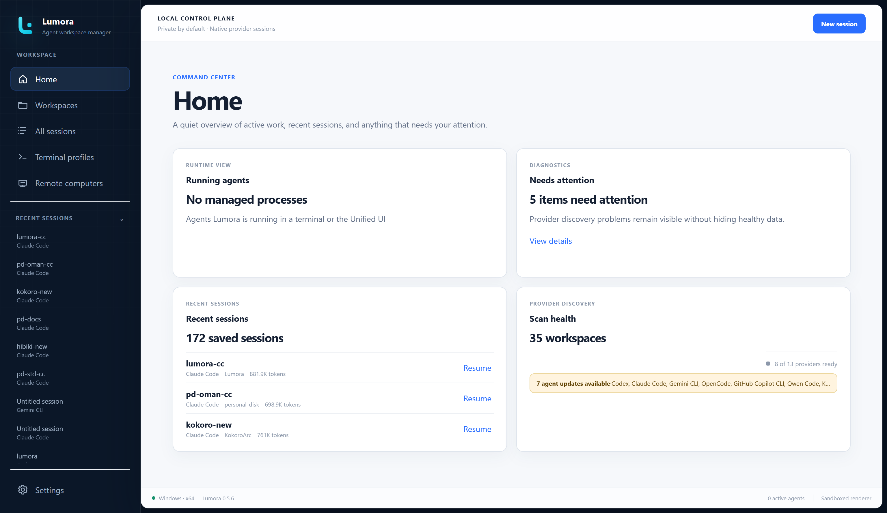
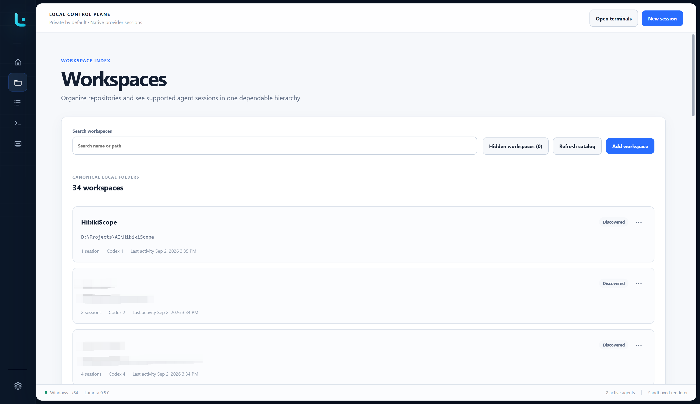
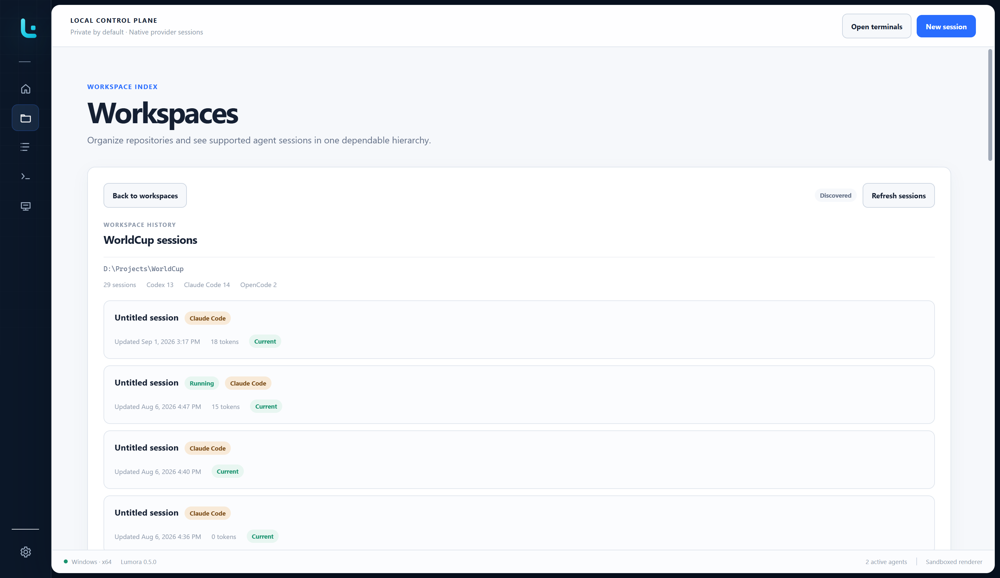
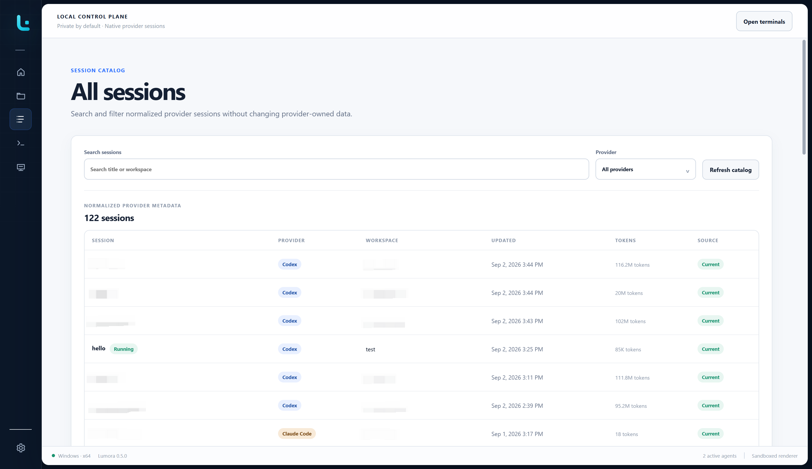
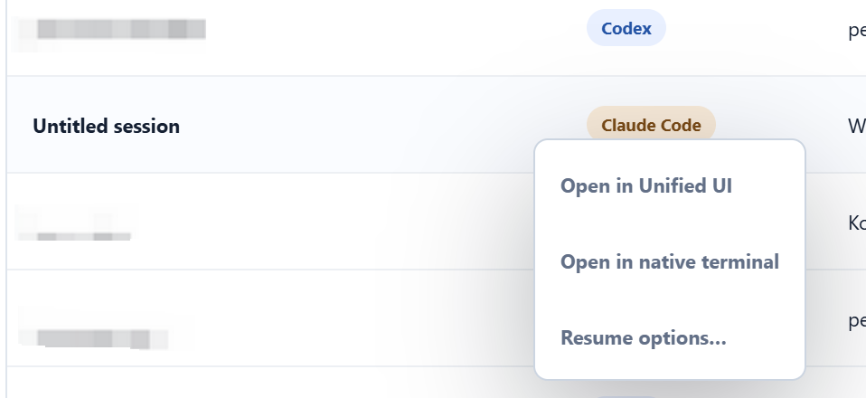

# Using Lumora

Lumora is a local-first desktop workspace for installed AI-agent command-line
tools. It discovers provider-owned sessions, groups them by workspace, and
runs agents in either Lumora's local Unified UI or a managed native terminal.
The provider continues to own authentication, session files, permissions, and
usage limits.

For installation and system requirements, start with the
[README](../README.md#get-lumora).

## First run

1. Open **Settings > Environment** and confirm Node.js and npm are available.
2. Open **Settings > Providers**, enable the agents you want Lumora to scan,
   and review their detected versions.
3. Install or authenticate each provider using its supported Lumora action or
   official instructions.
4. Open **Workspaces**, add a project directory, then select **New session**.
5. Choose a provider and terminal profile, review the effective launch, and
   confirm trust for the exact workspace path.

Every provider is optional. A missing or incompatible provider does not stop
healthy providers from working.

## Home and the sidebar

Home summarizes running agents, recent provider-owned sessions, catalog
health, and provider updates that need attention.

<p align="center">
  
</p>

The expanded sidebar keeps **Running sessions** separate from **Recent
sessions**. Running sessions open their existing Lumora runtime. Recent
sessions use the normal resume route. Each list can be collapsed independently
and refreshes when a managed runtime exits. The recent list loads progressively
as it scrolls.

Collapse the main sidebar to keep only navigation icons. Session lists then
disappear and the terminal tab strip becomes the primary session switcher.
Lumora remembers the sidebar state across application launches.

## Workspaces

The Workspaces page groups provider-owned sessions by project directory.
Search filters the visible cards without changing the catalog.

<p align="center">
  
</p>

Select a workspace card to open its session list. Starting a new session from
that page preselects the current workspace.

<p align="center">
  
</p>

To remove an old project from everyday navigation without deleting it, choose
**Hide workspace** from the workspace actions. You can hide only the workspace
card while retaining its sessions, or hide the workspace and its sessions.
Use **Hidden workspaces** to search, select, and restore hidden entries.

Lumora never deletes the project directory or provider-owned session data when
a workspace is hidden.

## Saved sessions

All Sessions searches across titles and workspaces and filters by installed,
enabled providers for which Lumora found sessions. Token totals appear when a
provider exposes reliable all-time usage metadata.

Session names and workspaces are owned by the provider, so renaming a session
inside the provider is reflected in Lumora on the next catalog refresh. A
session stays grouped under the workspace it started in even when the agent
later works in other folders, such as a git worktree or a subdirectory, because
that is the workspace the provider resumes it from.

<p align="center">
  
</p>

Select a stopped session to resume it directly. Lumora:

- returns to the existing runtime when that provider session is already
  running in Lumora;
- uses the verified local Unified UI when it is enabled for the provider; or
- resumes through a managed native terminal when Unified UI is unavailable or
  disabled.

Right-click a stopped session to choose an explicit route. **Open in native
terminal** affects that launch only and does not overwrite the saved Unified UI
preference. **Resume options…** opens the advanced workflow for provider-native
fork, cross-agent handoff, an initial task, or one-time launch overrides.

<p align="center">
  
</p>

Codex, Claude Code, and OpenCode support provider-native forks when the
installed version meets Lumora's tested minimum. Cross-agent handoff is a
separate opt-in workflow: it creates a new destination-provider session from a
temporary managed copy and leaves the source session unchanged. For a large
file-backed history, Lumora retains bounded opening and recent conversation
context and reports when older content was condensed.

See [Provider support and verification](PROVIDER_SUPPORT.md) for the exact
capability matrix and [Move sessions between devices](SESSION_TRANSFER.md) for
export and import.

## Start a new session

Select **New session**, then choose a workspace, enabled provider, and terminal
profile. An initial task is optional. A blank task sends nothing to the agent.

The launch preview shows the effective command, working directory, terminal,
and the layer that supplied each value. Lumora resolves settings in this order:

```text
Global < Provider < Workspace < Session < One-time launch
```

Custom commands, aliases, and wrappers work when the selected terminal profile
can resolve them. Lumora asks for workspace trust before the Start action is
available unless **Settings > Security > Automatically trust workspaces** has
been explicitly enabled and confirmed.

## Unified UI

Lumora 0.5 offers a local chat-style interface for verified structured
provider integrations. It supports streamed Markdown, provider commands and
models, tool activity, approvals, file changes, cancellation, progressive
history, and session details when the provider exposes them.

See the complete [Unified UI guide](UNIFIED_UI.md).

## Managed native terminals

Native provider TUIs run in managed PTYs and stay mounted while you navigate
between Lumora pages. With the sidebar expanded, select the session under
**Running sessions**. With it collapsed, use the terminal tabs or the configured
terminal-switcher shortcut.

When the provider exits, Lumora closes the runtime view and refreshes the
catalog and sidebar. Stopping a session uses a graceful provider-aware shutdown
before forceful termination. A full Lumora exit also warns before stopping
active local or remote agents when the corresponding General settings are
enabled.

### Clipboard and interrupts

- **Windows and Linux:** `Ctrl+V` pastes. `Ctrl+Shift+C` and `Ctrl+Shift+V`
  always copy and paste. `Ctrl+C` copies selected text. Right-click pastes text
  or a supported clipboard image into a live terminal.
- **macOS:** `Command+C` copies and `Command+V` pastes. Right-click also pastes.
- With no selection, the first `Ctrl+C` arms an interrupt and the second press
  stops the managed runtime, reducing accidental interruption.

Provider-native shortcuts are forwarded except for configured Lumora
shortcuts. Codex `Shift+Enter` multiline input remains a known embedded-terminal
limitation; see [Troubleshooting](TROUBLESHOOTING.md#codex-shiftenter-does-not-create-a-new-line).

## Terminal profiles

Terminal profiles describe the shell Lumora uses to resolve provider commands,
aliases, wrappers, and environment initialization. Open **Terminal profiles**
to inspect detected shells and choose the default. Provider-specific commands
remain under **Settings > Providers**, while additional layered launch values
belong under **Settings > Launch**.

## Default keyboard shortcuts

All application shortcuts can be changed under **Settings > Keyboard**.
Lumora intentionally does not use browser-style `Tab` or `Shift+Tab` navigation.

| Default shortcut | Action |
| --- | --- |
| `Ctrl+Tab` | Cycle active terminal tabs while the terminal page is visible |
| Up / Down | Change the highlighted session while the terminal switcher is open |
| `Alt+Shift+Left` / `Alt+Shift+Right` | Move the focused terminal tab |
| `Ctrl+Shift+T` | Return to running terminals and focus terminal input |
| `Ctrl+Shift+L` | Collapse or expand the sidebar |
| `Ctrl+1` | Open Home |
| `Ctrl+2` | Open Workspaces |
| `Ctrl+3` | Open All Sessions |
| `Ctrl+4` | Open Terminal Profiles |
| `Ctrl+5` | Open Remote Computers |
| `Ctrl+,` | Open Settings |

## More guides

- [Settings and customization](SETTINGS.md)
- [Remote computers](REMOTE.md)
- [Move sessions between devices](SESSION_TRANSFER.md)
- [Provider support and verification](PROVIDER_SUPPORT.md)
- [Troubleshooting Lumora](TROUBLESHOOTING.md)
